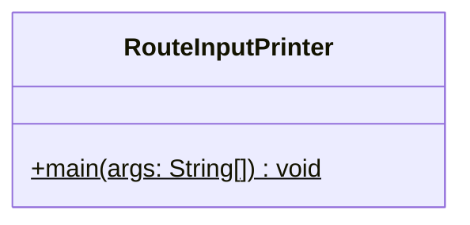
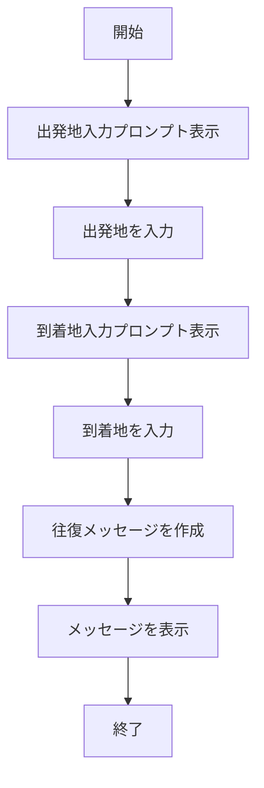

# RouteInputPrinter 詳細設計書

## 1. 機能要件

- キーボードから出発地と到着地を入力として受け取る
- 入力された2つの地点を使用して往復経路を表示する
- 入力例：出発地に「岡山」、到着地に「東京」を入力
- 出力例：「岡山～東京を往復します。」

## 2. クラス設計

### 2.1 クラス図



### 2.2 クラス定義

| 項目 | 内容 |
|------|------|
| クラス名 | RouteInputPrinter |
| パッケージ/名前空間 | なし（デフォルトパッケージ） |
| 修飾子 | public |

## 3. クラス図の各操作が実現すべき処理

### 3.1 main

- 出発地の入力を受け付ける
- 到着地の入力を受け付ける
- 入力された地点を使用して往復メッセージを作成
- メッセージを表示

## 4. 処理フロー

### 4.1 処理フローチャート



## 5. 入出力設計

### 5.1 入力仕様

- キーボードから2回の文字列入力を受け付ける
  1. 出発地：任意の文字列
  2. 到着地：任意の文字列

### 5.2 出力仕様

1. プロンプトメッセージ
   - 出発地入力用：">出発地："
   - 到着地入力用：">到着地："

2. 往復メッセージ
   - 形式："{出発地}～{到着地}を往復します。"
   - {}内は入力された文字列で置換

3. 出力例：

   ```text
   >出発地：岡山
   >到着地：東京
   岡山～東京を往復します。
   ```

## 6. エラー処理

- なし（入力値の検証は行わない）
