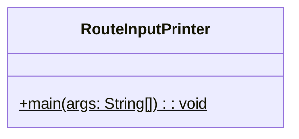
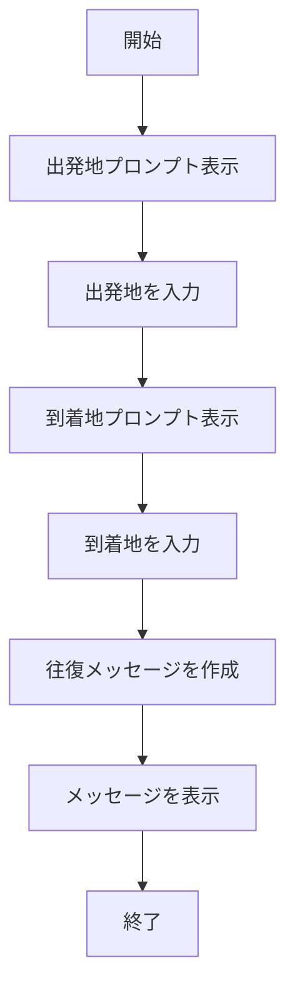
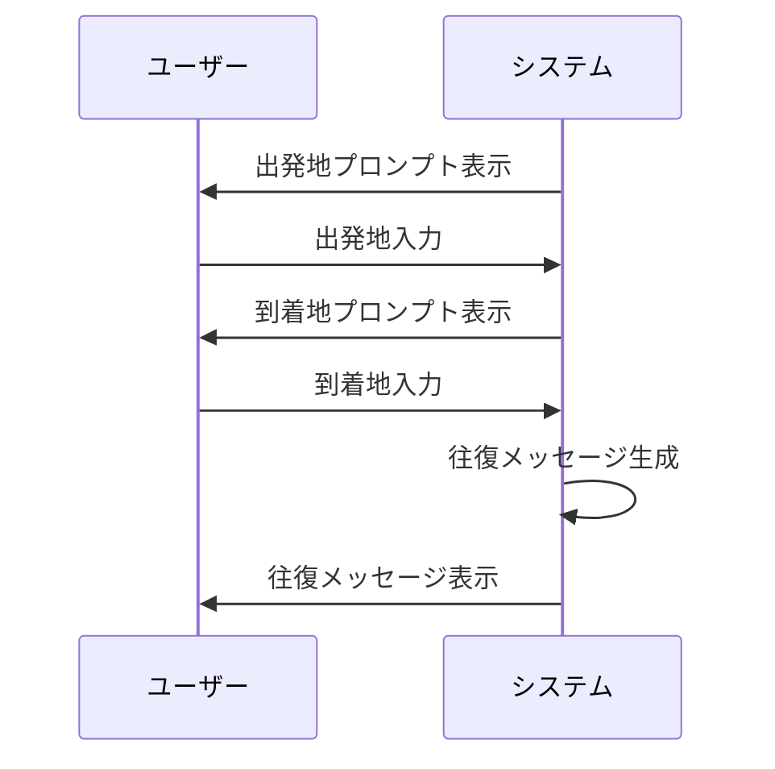

# RouteInputPrinter 詳細設計書

## 1. 機能要件

- ユーザーから出発地と到着地をキーボード入力で受け取る
- 入力された2つの地点を使用して往復メッセージを表示
- メッセージは入力された地点を結合して往復表現を作成

## 2. クラス設計

### 2.1 クラス図



### 2.2 クラス定義

| 項目 | 内容 |
|------|------|
| クラス名 | RouteInputPrinter |
| パッケージ/名前空間 | なし（デフォルトパッケージ） |
| 修飾子 | public |

## 3. メソッド設計

### 3.1 mainメソッド

#### 3.1.1 メソッド定義

| 項目 | 内容 |
|------|------|
| 修飾子 | public static |
| 戻り値の型 | void |
| メソッド名 | main |
| 引数 | String[] args |

#### 3.1.2 機能説明

- 標準入力から出発地を読み込む
- 標準入力から到着地を読み込む
- 入力された地点を使用して往復メッセージを作成
- メッセージを標準出力に表示

## 4. 処理フロー

### 4.1 処理フローチャート



### 4.2 システム動作シーケンス

※ユーザー入力を含む処理のため、シーケンス図で相互作用を示す



## 5. 入出力設計

### 5.1 入力仕様

1. 入力方法
   - システムはユーザーから2回の文字列入力を受け付ける
   - 各入力前に適切なプロンプトを表示
   - 入力された文字列は一時保存される

2. 入力値の制約
   - 任意の文字列を許容
   - 空文字列も有効な入力として扱う
   - 最大文字数の制限なし

※具体的な入力方法の実装については、各言語のガイドラインを参照してください。

### 5.2 出力仕様

1. プロンプトメッセージ
   - 出発地入力用：">出発地："
   - 到着地入力用：">到着地："

2. 往復メッセージ
   - 形式："{出発地}～{到着地}を往復します。"
   - {}内は入力された文字列で置換

3. 出力例：

   ```text
   >出発地：岡山
   >到着地：東京
   岡山～東京を往復します。
   ```

## 6. エラー処理

- なし（入力値の検証は行わない）
