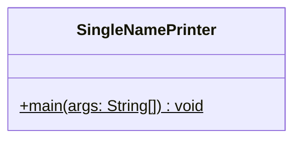
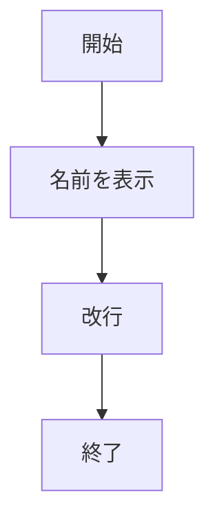

# SingleNamePrinter 詳細設計書

## 1. 機能要件

- プログラム内に直接記述した名前を画面に表示する
- キーボード等からの入力は行わない

## 2. クラス設計

### 2.1 クラス図



### 2.2 クラス定義

| 項目 | 内容 |
|------|------|
| クラス名 | SingleNamePrinter |
| パッケージ/名前空間 | なし（デフォルトパッケージ） |
| 修飾子 | public |

## 3. クラス図の各操作が実現すべき処理

### 3.1 main

- 名前を1行で表示
- 表示後に改行を行う

## 4. 処理フロー

### 4.1 処理フローチャート



## 5. 入出力設計

### 5.1 入力仕様

- なし

### 5.2 出力仕様

1. 表示メッセージ
   - 名前を1行で表示
   - 表示後に改行

2. 出力例：

   ```text
   山田太郎
   ```

## 6. エラー処理

- なし
