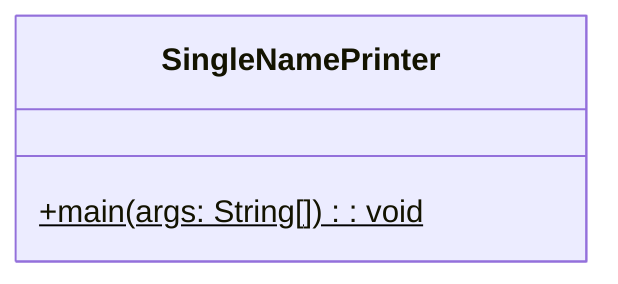
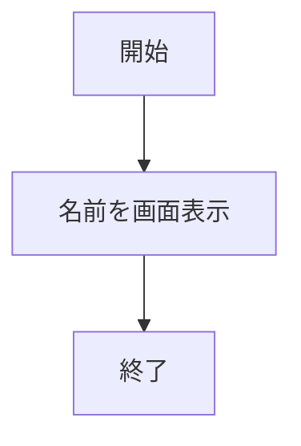

# SingleNamePrinter.java 詳細設計書

## 1. 機能要件

- 指定された名前を1行で画面に表示するプログラム

## 2. クラス設計

### 2.1 クラス図



### 2.2 クラス定義

| 項目 | 内容 |
|------|------|
| クラス名 | SingleNamePrinter |
| パッケージ | なし（デフォルトパッケージ） |
| 修飾子 | public |

## 3. メソッド設計

### 3.1 mainメソッド

#### 3.1.1 メソッド定義

| 項目 | 内容 |
|------|------|
| 修飾子 | public static |
| 戻り値の型 | void |
| メソッド名 | main |
| 引数 | String[] args |

#### 3.1.2 機能説明

- プログラムのエントリーポイント
- 名前を画面に1行で表示する

## 4. 処理フロー



## 5. 入出力設計

### 5.1 入力仕様

- なし

### 5.2 出力仕様

- 標準出力に名前を1行で表示
- 出力例：

  ```text
  山田太郎
  ```

## 6. エラー処理

- なし

## 7. 実装上の注意点

### 7.1 コーディング規約

- クラス名は機能を表す名前とし、UpperCamelCase（パスカルケース）を使用
- メソッド名は小文字で始める（lowerCamelCase）
- インデントは半角スペース4個を使用

### 7.2 文字コード

- ソースコードの文字コードはUTF-8を使用

## 8. 動作環境と実行方法

### 8.1 必要な環境

- JDK (Java Development Kit) 8以上
- テキストエディタまたはIDE

### 8.2 実行方法

1. ソースファイルをコンパイル

   ```bash
   javac SingleNamePrinter.java
   ```

2. プログラムを実行

   ```bash
   java SingleNamePrinter
   ```
