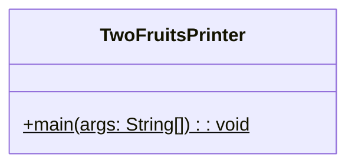
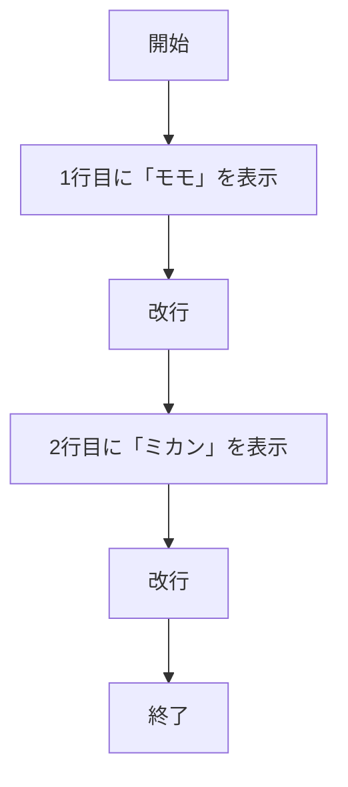

# TwoFruitsPrinter 詳細設計書

## 1. 機能要件

- 2つの文字列を別々の行に表示するプログラム
- 1行目に「モモ」を表示
- 2行目に「ミカン」を表示

## 2. クラス設計

### 2.1 クラス図



### 2.2 クラス定義

| 項目 | 内容 |
|------|------|
| クラス名 | TwoFruitsPrinter |
| パッケージ | なし（デフォルトパッケージ） |
| 修飾子 | public |

## 3. メソッド設計

### 3.1 mainメソッド

#### 3.1.1 メソッド定義

| 項目 | 内容 |
|------|------|
| 修飾子 | public static |
| 戻り値の型 | void |
| メソッド名 | main |
| 引数 | String[] args |

#### 3.1.2 機能説明

- プログラムのエントリーポイント
- 1行目に「モモ」を表示
- 2行目に「ミカン」を表示
- 各文字列の出力後に改行を行う

## 4. 処理フロー



## 5. 入出力設計

### 5.1 入力仕様

- なし

### 5.2 出力仕様

1. 出力メッセージ
   - 1行目に「モモ」を表示
   - 2行目に「ミカン」を表示
   - 各行の表示後に改行

1. 出力例：

   ```text
   モモ
   ミカン
   ```

## 6. エラー処理

- なし
