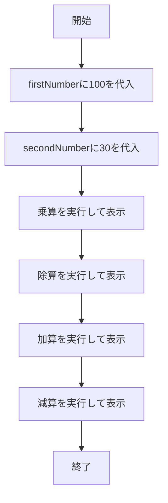

# BasicCalculator 詳細設計書

## 1. 機能要件

- 2つの固定値を使用して基本的な四則演算を実行
- 算術演算子（*、/、+、-）を使用して各種計算を実施
- 以下の演算を順に実行し結果を表示
  - 乗算（積）
  - 除算（商）- 浮動小数点の結果を表示
  - 加算（和）
  - 減算（差）

## 2. クラス設計

### 2.1 クラス図


### 2.2 クラス定義

| 項目 | 内容 |
|------|------|
| クラス名 | BasicCalculator |
| パッケージ | なし（デフォルトパッケージ） |
| 修飾子 | public |

## 3. メソッド設計

### 3.1 mainメソッド

#### 3.1.1 メソッド定義

| 項目 | 内容 |
|------|------|
| 修飾子 | public static |
| 戻り値の型 | void |
| メソッド名 | main |
| 引数 | String[] args |

#### 3.1.2 機能説明

- firstNumberに100を代入
- secondNumberに30を代入
- 以下の計算を順に実行し、結果を表示
  1. 乗算：firstNumber * secondNumber
  1. 除算：firstNumber / secondNumber（浮動小数点演算）
  1. 加算：firstNumber + secondNumber
  1. 減算：firstNumber - secondNumber

## 4. 処理フロー

### 4.1 処理フローチャート



## 5. 入出力設計

### 5.1 入力仕様

- なし（固定値を使用）
  - firstNumber: 100
  - secondNumber: 30

### 5.2 出力仕様

1. 計算結果表示
   - 形式："{第1項} {演算子} {第2項} = {計算結果}"
   - 各計算を改行で区切って表示
   - 除算の結果は浮動小数点数で表示
   - 各行は計算式と結果のみをシンプルに表示

1. 出力例：

   ```text
   100 * 30 = 3000
   100 / 30 = 3.3333333333333335
   100 + 30 = 130
   100 - 30 = 70
   ```

## 6. エラー処理

- なし（固定値を使用し、基本的な算術演算のみを行うため、エラーは発生しない）

## 7. 注意事項

- 除算の結果は浮動小数点数として計算するため、int型からdouble型へのキャストが必要
- 数値は固定値を使用するため、実運用ではなく教育・学習目的のプログラムとして設計
