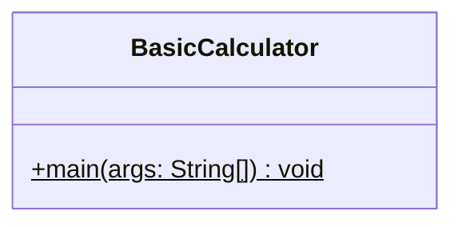
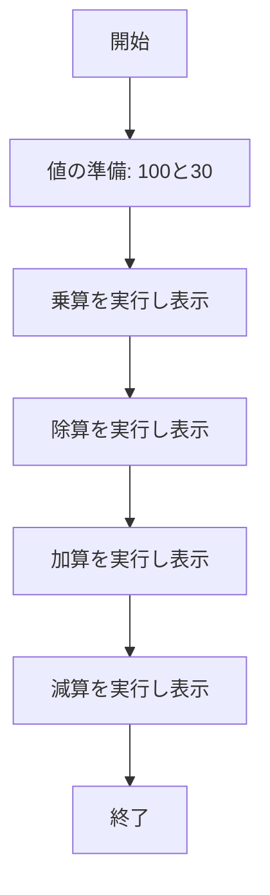

# BasicCalculator 詳細設計書

## 1. 機能要件

- プログラム内で2つの固定値（100と30）を使用する
- 以下の四則演算を順に実行し結果を表示：
  1. 乗算（積）
  2. 除算（商）- 浮動小数点の結果を表示
  3. 加算（和）
  4. 減算（差）
- キーボード等からの入力は行わない

## 2. クラス設計

### 2.1 クラス図



### 2.2 クラス定義

| 項目 | 内容 |
|------|------|
| クラス名 | BasicCalculator |
| パッケージ/名前空間 | なし（デフォルトパッケージ） |
| 修飾子 | public |

## 3. クラス図の各操作が実現すべき処理

### 3.1 main

- 第1の値（100）と第2の値（30）を用意
- 乗算を実行し、結果を表示
- 除算を実行し、結果を表示（小数点以下も表示）
- 加算を実行し、結果を表示
- 減算を実行し、結果を表示

## 4. 処理フロー

### 4.1 処理フローチャート



## 5. 入出力設計

### 5.1 入力仕様

- なし

### 5.2 出力仕様

1. 計算結果表示
   - 形式："{第1値} {演算子} {第2値} = {計算結果}"
   - 各計算を改行で区切って表示
   - 除算の結果は浮動小数点数で表示

2. 出力例：

   ```text
   100 * 30 = 3000
   100 / 30 = 3.3333333333333335
   100 + 30 = 130
   100 - 30 = 70
   ```

## 6. エラー処理

- なし（固定値を使用するため）
