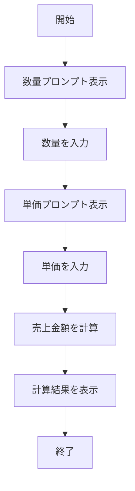

# SalesCalculator 詳細設計書

## 1. 機能要件

- キーボードから単価と数量を入力として受け取る
- 入力された値から売上金額を計算
- 計算結果を画面に表示
- 入力値は整数のみを扱い、正しい値が入力されることを前提とする

## 2. クラス設計

### 2.1 クラス図


### 2.2 クラス定義

| 項目 | 内容 |
|------|------|
| クラス名 | SalesCalculator |
| パッケージ/名前空間 | なし（デフォルトパッケージ） |
| 修飾子 | public |

## 3. クラス図の各操作が実現すべき処理

### 3.1 main

- キーボードから数量を読み込む
- キーボードから単価を読み込む
- 入力された値を整数に変換
- 売上金額を計算（数量 × 単価）
- 計算結果を表示

## 4. 処理フロー

### 4.1 処理フローチャート



## 5. 入出力設計

### 5.1 入力仕様

- キーボードから2回の整数入力を受け付ける
  1. 数量（quantity）: 商品の個数
  2. 単価（unitPrice）: 1個あたりの価格
- 各入力値は整数のみとし、正しい値が入力されることを前提とする

### 5.2 出力仕様

1. プロンプトメッセージ
   - 数量入力用："数量？ "
   - 単価入力用："単価？ "

2. 計算結果メッセージ
   - 形式："売上 = {totalAmount}"
   - {totalAmount}は数量×単価の計算結果で置換

3. 出力例：

   ```text
   数量？ 28
   単価？ 250
   売上 = 7000
   ```

## 6. エラー処理

- なし（入力値は整数で、かつ正しい値が入力されることを前提とする）
