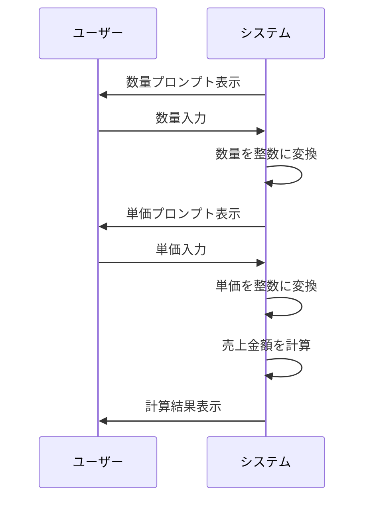

# SalesCalculator 詳細設計書

## 1. 機能要件

- ユーザーから商品の単価と数量を入力として受け取る
- 入力された値から売上金額を計算
- 計算結果を画面に表示
- 入力値は整数のみを扱い、正しい値が入力されることを前提とする

## 2. クラス設計

### 2.1 クラス図


### 2.2 クラス定義

| 項目 | 内容 |
|------|------|
| クラス名 | SalesCalculator |
| パッケージ/名前空間 | なし（デフォルトパッケージ） |
| 修飾子 | public |

## 3. メソッド設計

### 3.1 mainメソッド

#### 3.1.1 メソッド定義

| 項目 | 内容 |
|------|------|
| 修飾子 | public static |
| 戻り値の型 | void |
| メソッド名 | main |
| 引数 | String[] args |

#### 3.1.2 機能説明

- 標準入力から数量（quantity）を読み込む
- 標準入力から単価（unitPrice）を読み込む
- 入力された文字列を整数に変換
- 売上金額（totalAmount）を計算：quantity * unitPrice
- 計算結果を表示

## 4. 処理フロー

### 4.1 処理フローチャート


### 4.2 システム動作シーケンス

※ユーザー入力を含む処理のため、シーケンス図で相互作用を示す



## 5. 入出力設計

### 5.1 入力仕様

1. 入力方法
   - キーボードから2回の整数入力を受け付ける
   - 各入力前に適切なプロンプトを表示
   - 入力順：数量 → 単価

2. 入力値の制約
   - 整数のみ
   - 正しい値が入力されることを前提

※具体的な入力方法の実装については、各言語のガイドラインを参照してください。

### 5.2 出力仕様

1. プロンプトメッセージ
   - 数量入力用："数量？ "
   - 単価入力用："単価？ "

2. 計算結果メッセージ
   - 形式："売上 = {totalAmount}"
   - {totalAmount}は数量×単価の計算結果で置換

3. 出力例：

   ```text
   数量？ 28
   単価？ 250
   売上 = 7000
   ```

## 6. エラー処理

- なし（入力値は整数で、かつ正しい値が入力されることを前提とする）

## 7. 注意事項

- 教育・学習目的のプログラムとして、基本的な入力検証は省略
- 実運用では以下の検証を追加することが望ましい：
  - 入力値の数値検証（整数変換可能か）
  - 負の値や異常に大きな値のチェック
  - 計算結果のオーバーフロー確認
