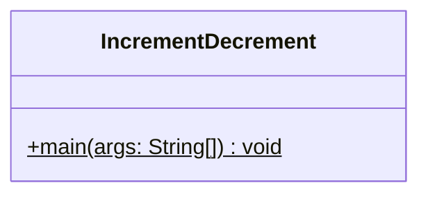
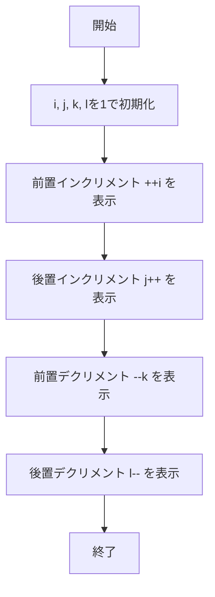

# IncrementDecrement 詳細設計書

## 1. 機能要件

- インクリメント演算子（前置・後置）の動作確認
- デクリメント演算子（前置・後置）の動作確認
- それぞれの演算結果を画面に表示して違いを明確化
- キーボード等からの入力は行わない

## 2. クラス設計

### 2.1 クラス図



### 2.2 クラス定義

| 項目 | 内容 |
|------|------|
| クラス名 | IncrementDecrement |
| パッケージ/名前空間 | なし（デフォルトパッケージ） |
| 修飾子 | public |

## 3. クラス図の各操作が実現すべき処理

### 3.1 main

- 変数i, j, k, lを1で初期化
- 前置インクリメント（++i）の結果を表示
- 後置インクリメント（j++）の結果を表示
- 前置デクリメント（--k）の結果を表示
- 後置デクリメント（l--）の結果を表示

## 4. 処理フロー

### 4.1 処理フローチャート



## 5. 入出力設計

### 5.1 入力仕様

- なし

### 5.2 出力仕様

1. 演算結果表示
   - 形式："{演算子} の結果: {値}"
   - 演算子と"の結果"の間にスペース
   - コロンと値の間にスペース
   - 各結果を改行で区切って表示

2. 出力例：

   ```text
   ++i の結果: 2
   j++ の結果: 1
   --k の結果: 0
   l-- の結果: 1
   ```

## 6. エラー処理

- なし（固定値による演算のため）
