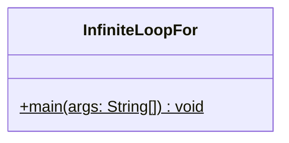
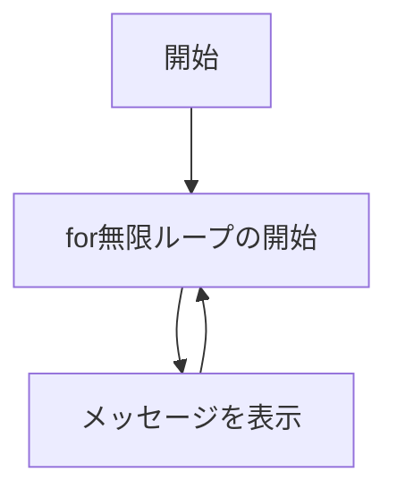

# InfiniteLoopFor 詳細設計書

## 1. 機能要件

- "無限ループ"というメッセージを継続的に表示
- for文を使用して実装すること

## 2. クラス設計

### 2.1 クラス図



### 2.2 クラス定義

| 項目 | 内容 |
|------|------|
| クラス名 | InfiniteLoopFor |
| パッケージ/名前空間 | なし（デフォルトパッケージ） |
| 修飾子 | public |

## 3. クラス図の各操作が実現すべき処理

### 3.1 main

- 無限ループの開始
- メッセージを継続的に表示

## 4. 処理フロー

### 4.1 処理フローチャート



## 5. 入出力設計

### 5.1 入力仕様

- なし

### 5.2 出力仕様

1. メッセージ表示
   - "無限ループ"という文字列を表示
   - 改行を含む
   - 継続的に繰り返し表示

2. 出力例：

   ```text
   無限ループ
   無限ループ
   無限ループ
   ```

   ※プログラムの実行を終了するには「Ctrl+C」を使用します。

## 6. エラー処理

- なし
