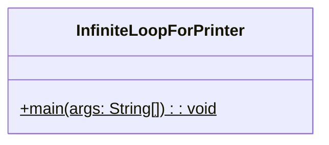
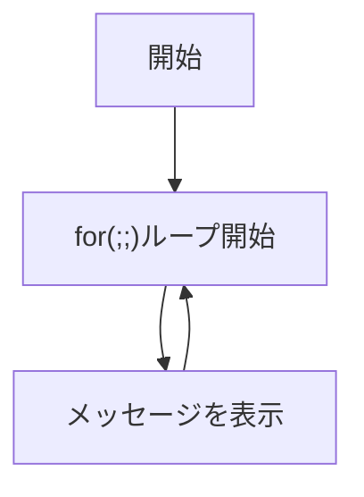

# InfiniteLoopForPrinter 詳細設計書

## 1. 機能要件

- for文を使用して無限ループを実装
- "無限ループ"というメッセージを継続的に表示
- Ctrl+Cによる強制終了が可能

## 2. クラス設計

### 2.1 クラス図



### 2.2 クラス定義

| 項目 | 内容 |
|------|------|
| クラス名 | InfiniteLoopForPrinter |
| パッケージ/名前空間 | なし（デフォルトパッケージ） |
| 修飾子 | public |

## 3. メソッド設計

### 3.1 mainメソッド

#### 3.1.1 メソッド定義

| 項目 | 内容 |
|------|------|
| 修飾子 | public static |
| 戻り値の型 | void |
| メソッド名 | main |
| 引数 | String[] args |

#### 3.1.2 機能説明

- for文の条件式を常に真となるように設定
- メッセージを継続的に表示
- プログラムの終了はCtrl+Cによる強制終了

## 4. 処理フロー

### 4.1 処理フローチャート



## 5. 入出力設計

### 5.1 入力仕様

- なし（Ctrl+Cによる終了のみ）

### 5.2 出力仕様

1. メッセージ表示
   - "無限ループ"というメッセージを表示
   - 改行を含む
   - 継続的に繰り返し表示

1. 出力例：

   ```text
   無限ループ
   無限ループ
   無限ループ
   （Ctrl+Cで終了するまで継続）
   ```

## 6. エラー処理

- なし（強制終了以外の終了手段なし）
