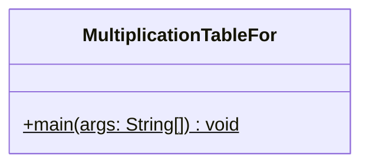
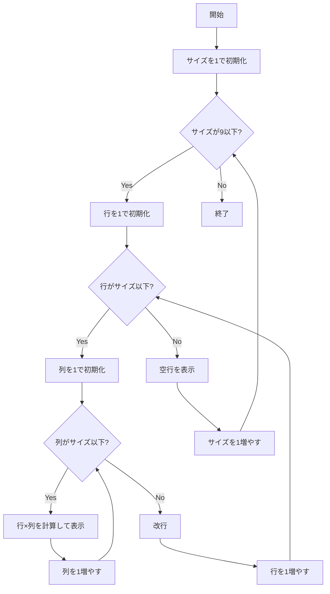

# MultiplicationTableFor 詳細設計書

## 1. 機能要件

- 1x1表から9x9表まで順次表示
- 各表のサイズを1行ずつ増やしながら表示
- シンプルなスペース区切りの出力形式
- for文を使用して実装すること
- キーボード等からの入力は行わない

## 2. クラス設計

### 2.1 クラス図



### 2.2 クラス定義

| 項目 | 内容 |
|------|------|
| クラス名 | MultiplicationTableFor |
| パッケージ/名前空間 | なし（デフォルトパッケージ） |
| 修飾子 | public |

## 3. クラス図の各操作が実現すべき処理

### 3.1 main

- 1から9までの表のサイズを順に処理
- 各サイズの表について：
  - 1から指定サイズまでの段を表示
  - 各段の計算結果をスペース区切りで表示
  - 各表の後に空行を表示

## 4. 処理フロー

### 4.1 処理フローチャート



## 5. 入出力設計

### 5.1 入力仕様

- なし

### 5.2 出力仕様

1. 各表の表示
   - 各数値はスペース1つで区切る
   - 各行の終わりで改行
   - 各表の後に空行を表示

2. 出力例：

   ```text
   1
   
   1 2
   2 4
   
   1 2 3
   2 4 6
   3 6 9
   
   1 2 3 4
   2 4 6 8
   3 6 9 12
   4 8 12 16
   
   （以下、9x9表まで続く）
   ```

## 6. エラー処理

- なし（固定範囲の計算のため）
