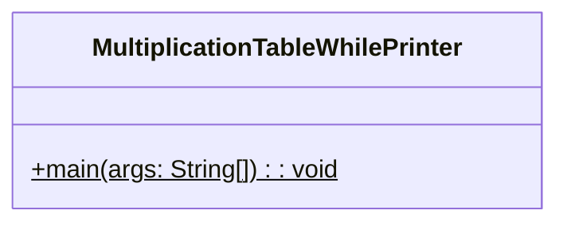
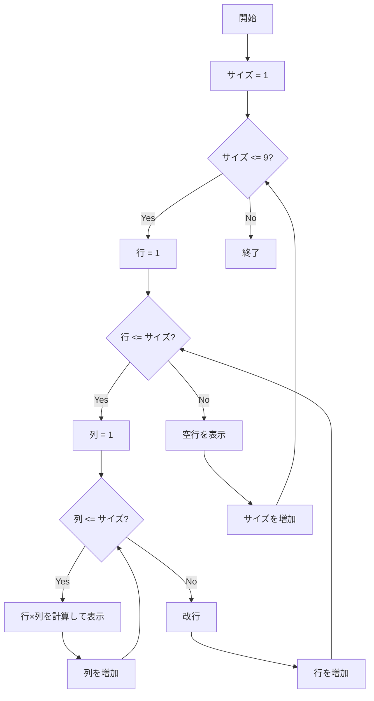

# MultiplicationTableWhilePrinter 詳細設計書

## 1. 機能要件

- while文を使用して九九表を表示
- 1x1表から9x9表まで順次表示
- 各表のサイズを1行ずつ増やしながら表示
- シンプルなスペース区切りの出力形式

## 2. クラス設計

### 2.1 クラス図



### 2.2 クラス定義

| 項目 | 内容 |
|------|------|
| クラス名 | MultiplicationTableWhilePrinter |
| パッケージ/名前空間 | なし（デフォルトパッケージ） |
| 修飾子 | public |

## 3. メソッド設計

### 3.1 mainメソッド

#### 3.1.1 メソッド定義

| 項目 | 内容 |
|------|------|
| 修飾子 | public static |
| 戻り値の型 | void |
| メソッド名 | main |
| 引数 | String[] args |

#### 3.1.2 機能説明

- 外側のループで表のサイズ（1から9まで）を制御
- 中間のループで行を制御
- 内側のループで列を制御
- 各位置（行×列）の積を計算して表示
- 各表の後に空行を表示

## 4. 処理フロー

### 4.1 処理フローチャート



## 5. 入出力設計

### 5.1 入力仕様

- なし

### 5.2 出力仕様

1. 各表の出力
   - 各数値はスペース1つで区切る
   - 各行の終わりで改行
   - 各表の後に空行を表示

1. 出力例：

   ```text
   1
   
   1 2
   2 4
   
   1 2 3
   2 4 6
   3 6 9
   
   1 2 3 4
   2 4 6 8
   3 6 9 12
   4 8 12 16
   
   （以下、9x9表まで続く）
   ```

## 6. エラー処理

- なし（固定範囲の計算のため）
