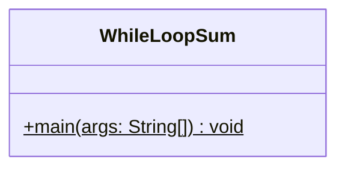
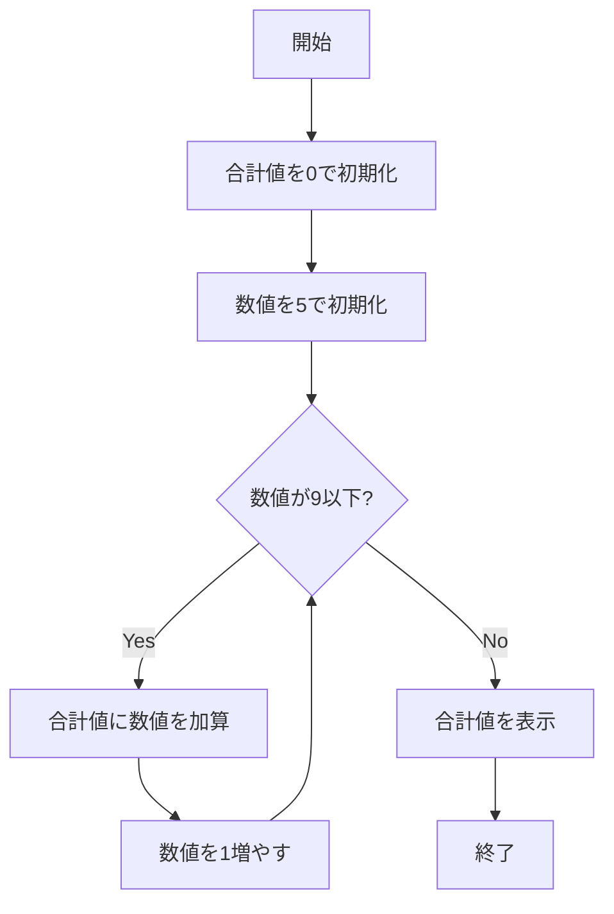

# WhileLoopSum 詳細設計書

## 1. 機能要件

- 連続する整数（5から9まで）の合計を計算
- 計算は5+6+7+8+9を実行
- while文を使用して実装すること
- 計算結果を画面に表示
- キーボード等からの入力は行わない

## 2. クラス設計

### 2.1 クラス図



### 2.2 クラス定義

| 項目 | 内容 |
|------|------|
| クラス名 | WhileLoopSum |
| パッケージ/名前空間 | なし（デフォルトパッケージ） |
| 修飾子 | public |

## 3. クラス図の各操作が実現すべき処理

### 3.1 main

- 合計値を0で初期化
- 整数5から9までの合計を計算
- 結果を表示

## 4. 処理フロー

### 4.1 処理フローチャート



## 5. 入出力設計

### 5.1 入力仕様

- なし

### 5.2 出力仕様

1. 計算結果表示
   - 合計値のみを表示
   - 改行を含む

2. 出力例：

   ```text
   35
   ```

## 6. エラー処理

- なし（固定範囲の計算のため）
