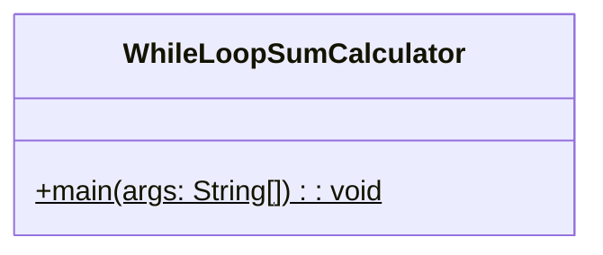
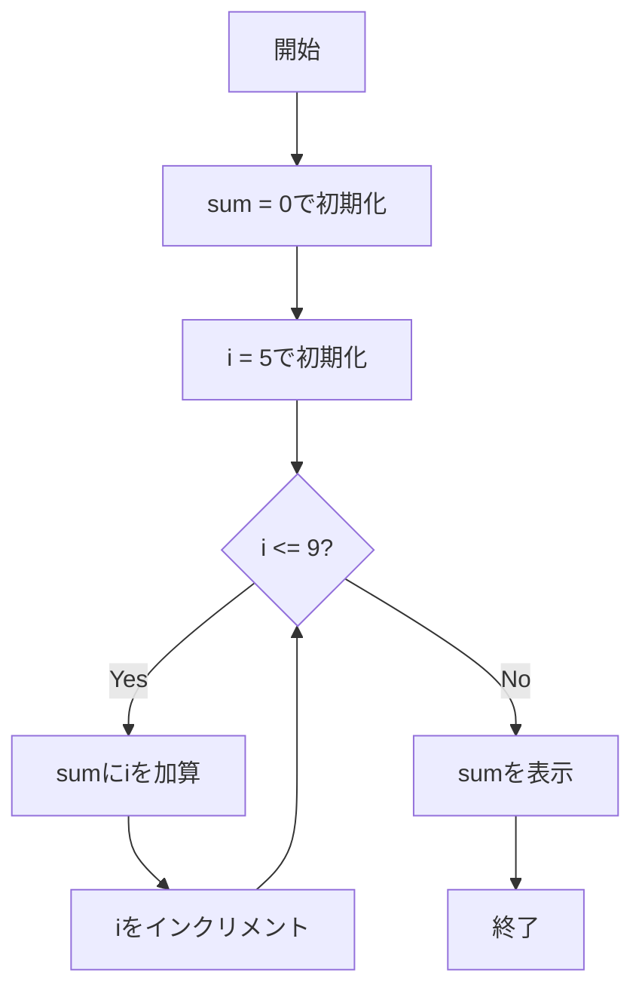

# WhileLoopSumCalculator 詳細設計書

## 1. 機能要件

- 連続する整数（5から9まで）の合計を計算
- while文を使用して実装
- 計算結果を画面に表示

## 2. クラス設計

### 2.1 クラス図



### 2.2 クラス定義

| 項目 | 内容 |
|------|------|
| クラス名 | WhileLoopSumCalculator |
| パッケージ/名前空間 | なし（デフォルトパッケージ） |
| 修飾子 | public |

## 3. メソッド設計

### 3.1 mainメソッド

#### 3.1.1 メソッド定義

| 項目 | 内容 |
|------|------|
| 修飾子 | public static |
| 戻り値の型 | void |
| メソッド名 | main |
| 引数 | String[] args |

#### 3.1.2 機能説明

- 合計値を保持する変数sumを0で初期化
- ループ変数iを5で初期化
- while文を使用して9以下の間、iの値を順次加算
- 計算結果を画面に表示

## 4. 処理フロー

### 4.1 処理フローチャート



## 5. 入出力設計

### 5.1 入力仕様

- なし（計算範囲は固定）

### 5.2 出力仕様

1. 計算結果表示
   - 合計値のみを表示
   - 改行を含む

1. 出力例：

   ```text
   35
   ```

## 6. エラー処理

- なし（固定範囲の計算のため）
