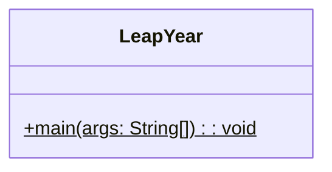
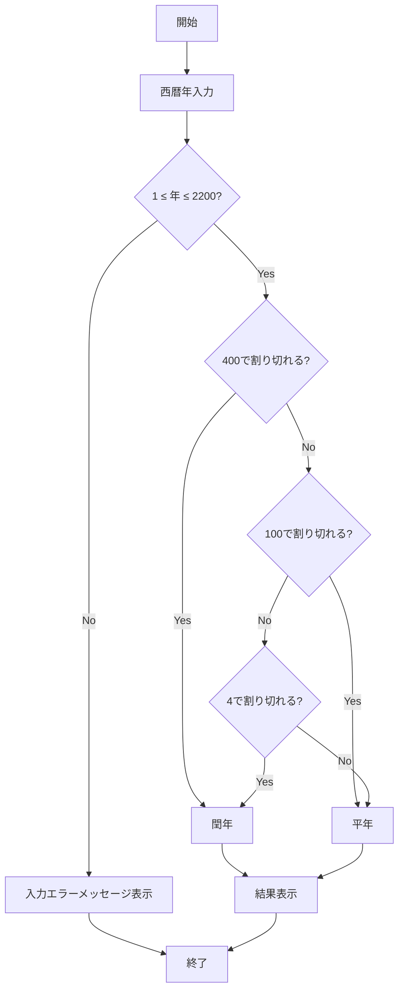
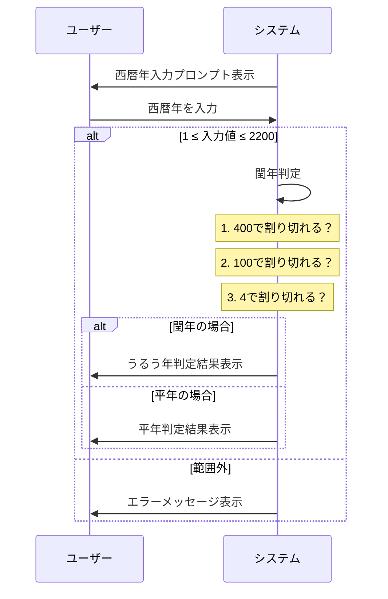

# LeapYear 詳細設計書

## 1. 機能要件

- 西暦年を入力として受け取る（1～2200年の範囲）
- 入力された年が閏年かどうかを判定
- 判定結果を画面に表示
- 範囲外の入力値に対してはエラーメッセージを表示

## 2. クラス設計

### 2.1 クラス図



### 2.2 クラス定義

| 項目 | 内容 |
|------|------|
| クラス名 | LeapYear |
| パッケージ/名前空間 | なし（デフォルトパッケージ） |
| 修飾子 | public |

## 3. メソッド設計

### 3.1 mainメソッド

#### 3.1.1 メソッド定義

| 項目 | 内容 |
|------|------|
| 修飾子 | public static |
| 戻り値の型 | void |
| メソッド名 | main |
| 引数 | String[] args |

#### 3.1.2 機能説明

- 標準入力から西暦年を読み込む
- 入力値の範囲チェック（1～2200）を実施
- 閏年の判定条件を以下の順序でチェック：
  1. 400で割り切れる → 閏年
  2. 100で割り切れる → 平年
  3. 4で割り切れる → 閏年、それ以外 → 平年
- 判定結果またはエラーメッセージを表示

## 4. 処理フロー

### 4.1 処理フローチャート



### 4.2 システム動作シーケンス



## 5. 入出力設計

### 5.1 入力仕様

1. 入力方法
   - 標準入力から整数値を1つ読み込む
   - プロンプトを表示して入力を促す

2. 入力値の制約
   - 整数値のみ
   - 有効範囲：1～2200年
   - 数値以外の値は入力されないものとする

## 5.2 出力仕様

1. プロンプトメッセージ
   - 入力用："西暦年（1～2200）？ "

2. 判定結果メッセージ
   - 形式："{年} 年は{判定結果}です。"
   - 判定結果は"うるう年"または"平年"

3. エラーメッセージ
   - 範囲外の入力値に対して："入力値に誤りがあります"

4. 出力例：

   ```text
   西暦年（1～2200）？ 2024
   2024 年はうるう年です。
   ```

   ```text
   西暦年（1～2200）？ 2100
   2100 年は平年です。
   ```

   ```text
   西暦年（1～2200）？ 0
   入力値に誤りがあります
   ```

   ```text
   西暦年（1～2200）？ 2201
   入力値に誤りがあります
   ```

## 6. エラー処理

1. 入力値の範囲チェック
   - 1未満、または2200より大きい値が入力された場合
   - エラーメッセージを表示して処理を終了
