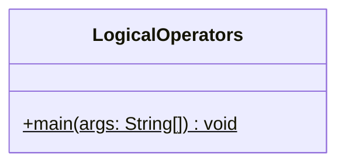
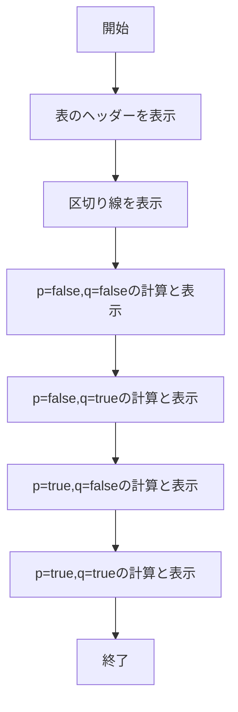

# LogicalOperators 詳細設計書

## 1. 機能要件

- 論理型変数p, qに対する各種論理演算の結果を真理値表として表示
- 以下の論理演算を実行して結果を表示:
  - 論理積（&, &&）
  - 論理和（|, ||）
  - 排他的論理和（^）
  - 否定（!）
  - 等価演算（==）
  - 非等価演算（!=）
- すべての真偽値の組み合わせ（4パターン）について計算を実行

## 2. クラス設計

### 2.1 クラス図



### 2.2 クラス定義

| 項目 | 内容 |
|------|------|
| クラス名 | LogicalOperators |
| パッケージ/名前空間 | なし（デフォルトパッケージ） |
| 修飾子 | public |

## 3. クラス図の各操作が実現すべき処理

### 3.1 main

- 表のヘッダーを表示
- 4つの真偽値の組み合わせそれぞれについて：
  1. p, qに値を設定
  2. 各種論理演算を実行
  3. 結果を1行にまとめて表示

## 4. 処理フロー

### 4.1 処理フローチャート



## 5. 入出力設計

### 5.1 入力仕様

- なし

### 5.2 出力仕様

1. ヘッダー行
   - 各列の項目名をタブ区切りで表示
   - 形式：p、q、p&q、p|q、p^q、!p、p&&q、p||q、p==q、p!=q

2. 区切り線
   - ヘッダー行の下に表示
   - ハイフン(-)による区切り線

3. データ行
   - 各論理演算の結果をタブ区切りで表示
   - 真偽値はtrue/falseで表示
   - 4行のデータを表示

4. 出力例：

   ```text
   p      q      p&q    p|q    p^q    !p     p&&q   p||q   p==q   p!=q
   ------------------------------------------------------------------
   false  false  false  false  false  true   false  false  true   false
   false  true   false  true   true   true   false  true   false  true
   true   false  false  true   true   false  false  true   false  true
   true   true   true   true   false  false  true   true   true   false
   ```

## 6. エラー処理

- なし（固定値による論理演算のため）
