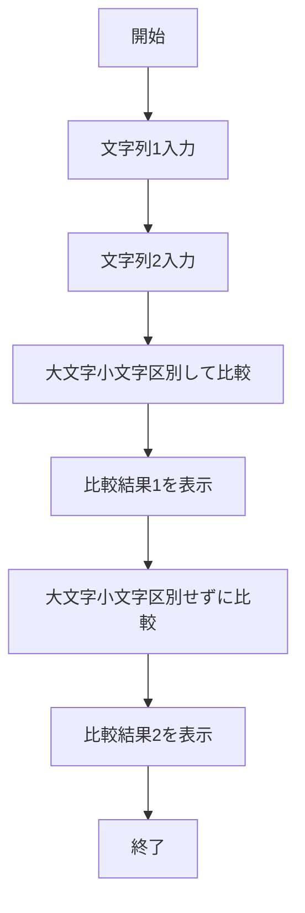

# StringComparison 詳細設計書

## 1. 機能要件

- 2つの文字列をキーボードから入力として受け取る
- 入力された文字列を2つの方法で比較:
  - 大文字と小文字を区別して比較
  - 大文字と小文字を区別せずに比較
- それぞれの比較結果を画面に表示

## 2. クラス設計

### 2.1 クラス図


### 2.2 クラス定義

| 項目 | 内容 |
|------|------|
| クラス名 | StringComparison |
| パッケージ/名前空間 | なし（デフォルトパッケージ） |
| 修飾子 | public |

## 3. クラス図の各操作が実現すべき処理

### 3.1 main

- キーボードから1つ目の文字列を読み込む
- キーボードから2つ目の文字列を読み込む
- 2つの比較を実行：
  1. 大文字小文字を区別した比較
  2. 大文字小文字を区別しない比較
- 各比較結果を表示

## 4. 処理フロー

### 4.1 処理フローチャート



## 5. 入出力設計

### 5.1 入力仕様

- キーボードから文字列を2回読み込む
- 任意の文字列を許容（空文字列を含む）
- 最大文字数の制限なし

### 5.2 出力仕様

1. プロンプトメッセージ
   - 1つ目の文字列入力用："文字列１を入力してください＞ "
   - 2つ目の文字列入力用："文字列２を入力してください＞ "

2. 比較結果メッセージ
   - 形式1："大文字と小文字を区別して比較：文字列１と文字列２は{結果}文字列です"
   - 形式2："大文字と小文字を区別しないで比較：文字列１と文字列２は{結果}文字列です"
   - {結果}は"同じ"または"違う"

3. 出力例：

   ```text
   文字列１を入力してください＞ aBcdefG
   文字列２を入力してください＞ abcdefg
   大文字と小文字を区別して比較：文字列１と文字列２は違う文字列です
   大文字と小文字を区別しないで比較：文字列１と文字列２は同じ文字列です
   ```

## 6. エラー処理

- なし（全ての入力文字列を受け付ける）
