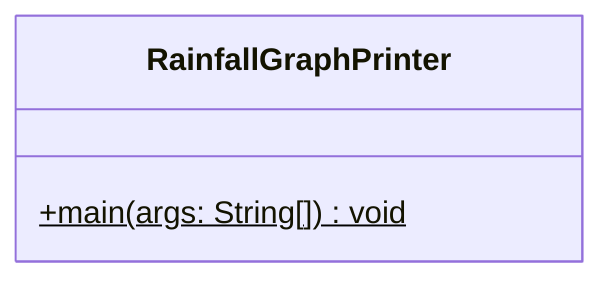
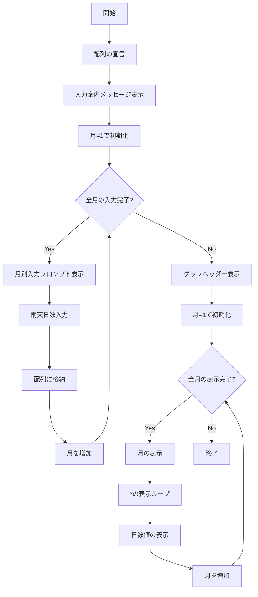

# RainfallGraphPrinter 詳細設計書

## 1. 機能要件

- 12ヶ月分の雨天日数データをキーボードから入力として受け取る
- 各月のデータを配列に格納して管理
- 月表示を自然に行うため、13要素の配列を使用（インデックス1-12を月に対応）
- 月ごとに以下の情報を表示：
  - 月の表示（1月〜12月）
  - 雨天日数に応じた"*"による棒グラフ
  - 実際の日数値
- 表示の際の空白は半角スペースを使用

## 2. クラス設計

### 2.1 クラス図



### 2.2 クラス定義

| 項目 | 内容 |
|------|------|
| クラス名 | RainfallGraphPrinter |
| パッケージ/名前空間 | なし（デフォルトパッケージ） |
| 修飾子 | public |

## 3. クラス図の各操作が実現すべき処理

### 3.1 main

- 13要素の整数配列を宣言（インデックス1-12を使用）
- 各月の雨天日数を順次入力：
  1. 月別の入力プロンプト表示
  2. キーボードからの入力受付
  3. 対応する配列要素への格納
- グラフのヘッダーを表示
- 各月のデータを順次表示：
  1. 月表示
  2. 日数分のアスタリスク表示
  3. 実際の日数値表示

## 4. 処理フロー

### 4.1 処理フローチャート



## 5. 入出力設計

### 5.1 入力仕様

1. 入力データ

   | 月 | 雨天の日数 |
   |----|------------|
   | 1  | 5         |
   | 2  | 6         |
   | 3  | 9         |
   | 4  | 10        |
   | 5  | 12        |
   | 6  | 10        |
   | 7  | 9         |
   | 8  | 11        |
   | 9  | 10        |
   | 10 | 7         |
   | 11 | 5         |
   | 12 | 6         |

2. 入力値の制約
   - 各月の値は正の整数
   - 値の検証は行わない（正しい値が入力されることを前提）

### 5.2 出力仕様

1. 入力案内メッセージ
   - "雨天の日数を入力？"を表示

2. 月別入力プロンプト
   - 形式："n 月？ "（nは1〜12）
   - スペースは半角

3. グラフ表示
   - ヘッダー："雨天の日数グラフ"
   - 月別データ形式："{n} 月 {アスタリスク} {日数}"
   - アスタリスクは日数分の"*"を連続表示
   - 項目間は半角スペースで区切る

4. 出力例：

   ```text
   雨天の日数を入力？
   1 月？ 5
   2 月？ 6
   3 月？ 9
   （中略）
   12 月？ 6
   雨天の日数グラフ
   1 月 ***** 5
   2 月 ****** 6
   3 月 ********* 9
   （中略）
   12 月 ****** 6
   ```

## 6. エラー処理

- なし（入力値は整数で、かつ正しい値が入力されることを前提）
