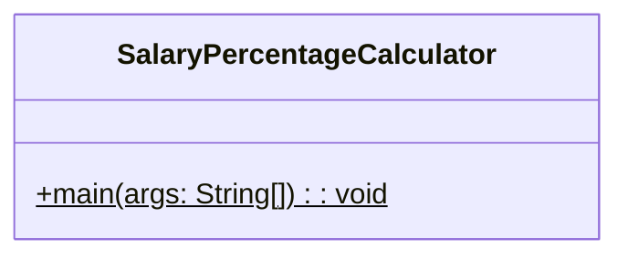
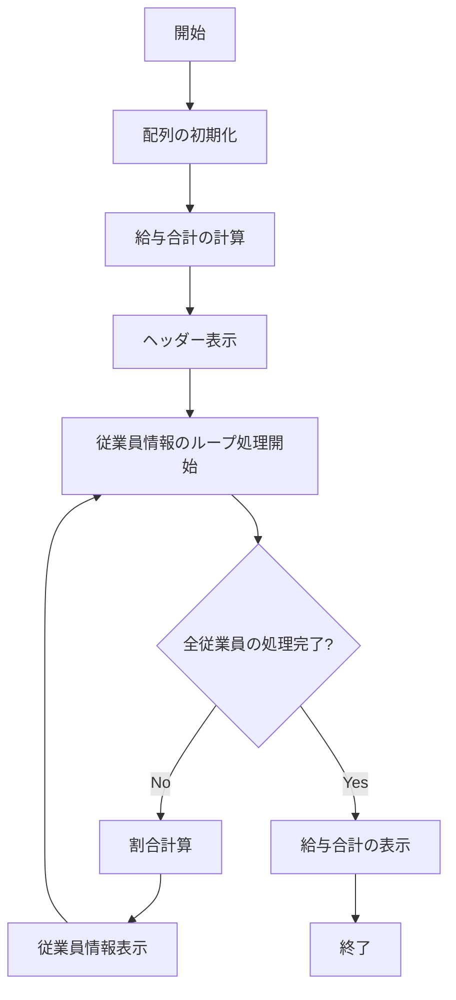

# SalaryPercentageCalculator 詳細設計書

## 1. 機能要件

- 固定の給与データを配列として管理する
- 氏名用配列と給与用配列で同じインデックスの要素を対応付けて管理する
- 各従業員の給与が全体に占める割合を計算する
- 計算された給与情報を表示する
- 全従業員の給与合計を表示する

## 2. クラス設計

### 2.1 クラス図



### 2.2 クラス定義

| 項目 | 内容 |
|------|------|
| クラス名 | SalaryPercentageCalculator |
| パッケージ/名前空間 | なし（デフォルトパッケージ） |
| 修飾子 | public |

## 3. メソッド設計

### 3.1 mainメソッド

#### 3.1.1 メソッド定義

| 項目 | 内容 |
|------|------|
| 修飾子 | public static |
| 戻り値の型 | void |
| メソッド名 | main |
| 引数 | String[] args |

#### 3.1.2 機能説明

- 氏名、給与、それぞれの配列の宣言と領域の確保を行い、給与表のデータで配列を初期化する
- 給与合計を算出する
- 各従業員の給与の割合を計算し、氏名・給与・割合の情報を表示する
- 最後に給与合計を表示する

## 4. 処理フロー

### 4.1 処理フローチャート



## 5. 入出力設計

### 5.1 入力仕様

- なし（固定データを使用）
- 初期データ：

  ```text
  [給与表]
  氏名        給与
  小暮次郎    184000円
  川村麻衣    175000円
  北上義徳    261000円
  佐野洋子    163000円
  松原雅彦    226000円
  ```

### 5.2 出力仕様

1. ヘッダー
   - "★ 給与の状況 ★"を表示
   - 改行を含む

2. 従業員情報（各従業員について）
   - 形式："{氏名} {給与} 約 {割合}％"
   - 割合は整数（四捨五入）
   - 各項目は半角スペースで区切る

3. 合計情報
   - 形式："給与合計 {合計額}"

4. 出力例：

   ```text
   ★ 給与の状況 ★
   小暮次郎 184000 約 18％
   川村麻衣 175000 約 17％
   北上義徳 261000 約 26％
   佐野洋子 163000 約 16％
   松原雅彦 226000 約 22％
   給与合計 1009000
   ```

## 6. エラー処理

- なし（固定データを使用するため）

## 7. 注意事項

- 処理内容に応じて適切なループ文（for文、拡張for文）を選択すること
- 配列の要素数の情報はlength属性を用いること
- パーセント計算時の小数点以下は四捨五入すること
- 表示時の空白はタブではなく半角スペースを使用すること
