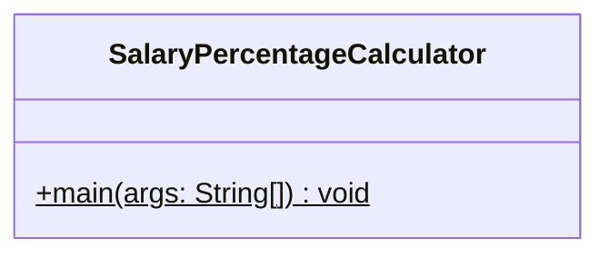

# SalaryPercentageCalculator 詳細設計書

## 1. 機能要件

- 固定の給与データを配列として管理
- 氏名用配列と給与用配列で同じインデックスの要素を対応付けて管理
- 各従業員の給与が全体に占める割合を計算（小数点以下は四捨五入）
- 計算された給与情報を表示（氏名、給与、割合）
- 全従業員の給与合計を表示
- 表示の際の空白は半角スペースを使用

## 2. クラス設計

### 2.1 クラス図



### 2.2 クラス定義

| 項目 | 内容 |
|------|------|
| クラス名 | SalaryPercentageCalculator |
| パッケージ/名前空間 | なし（デフォルトパッケージ） |
| 修飾子 | public |

## 3. クラス図の各操作が実現すべき処理

### 3.1 main

- 氏名、給与それぞれの配列を初期化
- 給与の合計額を算出
- 各従業員の情報を表示：
  1. ヘッダー表示
  2. 給与の割合を計算
  3. 氏名・給与・割合を表示
- 給与合計を表示

## 4. 処理フロー

### 4.1 処理フローチャート


## 5. 入出力設計

### 5.1 入力仕様

- なし（固定データを使用）
- 初期データ：

  | 氏名 | 給与 |
  |------|------|
  | 小暮次郎 | 184000円 |
  | 川村麻衣 | 175000円 |
  | 北上義徳 | 261000円 |
  | 佐野洋子 | 163000円 |
  | 松原雅彦 | 226000円 |

### 5.2 出力仕様

1. ヘッダー表示
   - "★ 給与の状況 ★"
   - 改行を含む

2. 従業員情報表示
   - 形式："{氏名} {給与} 約 {割合}％"
   - 割合は整数（四捨五入）
   - 各項目は半角スペースで区切る

3. 合計表示
   - 形式："給与合計 {合計額}"

4. 出力例：

   ```text
   ★ 給与の状況 ★
   小暮次郎 184000 約 18％
   川村麻衣 175000 約 17％
   北上義徳 261000 約 26％
   佐野洋子 163000 約 16％
   松原雅彦 226000 約 22％
   給与合計 1009000
   ```

## 6. エラー処理

- なし（固定データを使用するため）
