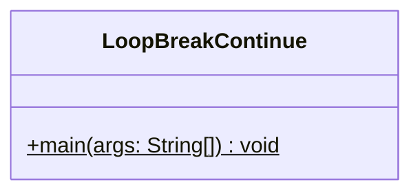
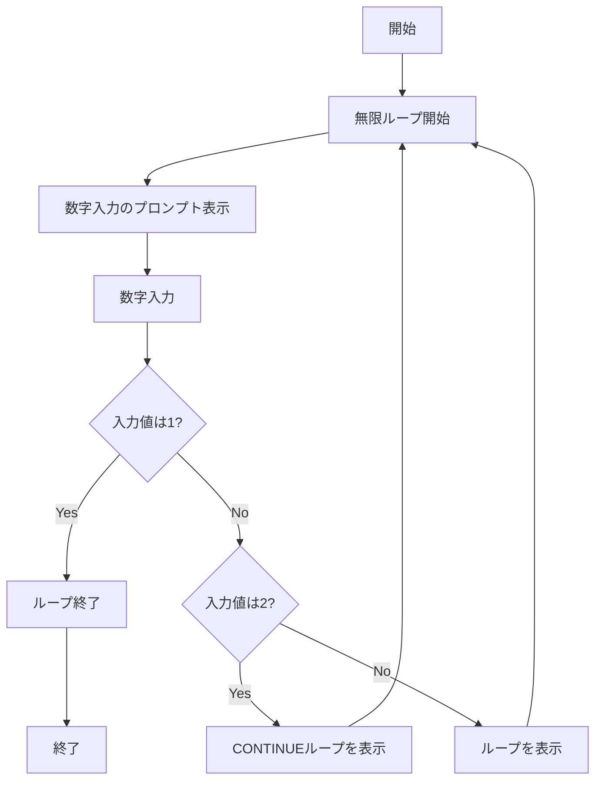

# LoopBreakContinue 詳細設計書

## 1. 機能要件

- 無限ループ内で数字入力を繰り返し受け付ける
- 入力値に応じて以下の処理を実行:
  1. 入力値が1の場合：ループを終了
  2. 入力値が2の場合：処理をスキップして次の入力へ（"CONTINUEループ"を表示）
  3. それ以外の場合："ループ"を表示して処理継続

## 2. クラス設計

### 2.1 クラス図



### 2.2 クラス定義

| 項目 | 内容 |
|------|------|
| クラス名 | LoopBreakContinue |
| パッケージ/名前空間 | なし（デフォルトパッケージ） |
| 修飾子 | public |

## 3. クラス図の各操作が実現すべき処理

### 3.1 main

- 無限ループを構築
- キーボードから整数値を入力として受け付け
- 入力値に応じて処理を分岐：
  1. 入力値が1：終了
  2. 入力値が2："CONTINUEループ"を表示
  3. その他："ループ"を表示

## 4. 処理フロー

### 4.1 処理フローチャート



## 5. 入出力設計

### 5.1 入力仕様

1. 入力データ
   - キーボードからの文字列入力
   - 任意の文字列入力を受け付ける

### 5.2 出力仕様

1. プロンプトメッセージ
   - 形式："数字入力 "
   - 改行なし

2. 処理結果メッセージ
   - 入力値が2の場合："CONTINUEループ"
   - それ以外の場合："ループ"
   - 改行を含む

3. 出力例：

   ```text
   数字入力 2
   CONTINUEループ
   数字入力 3
   ループ
   数字入力 1
   ```

## 6. エラー処理

- なし（"1", "2"以外の入力は全て通常ループとして処理）
