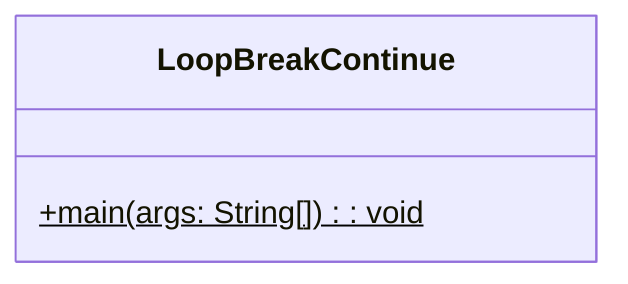
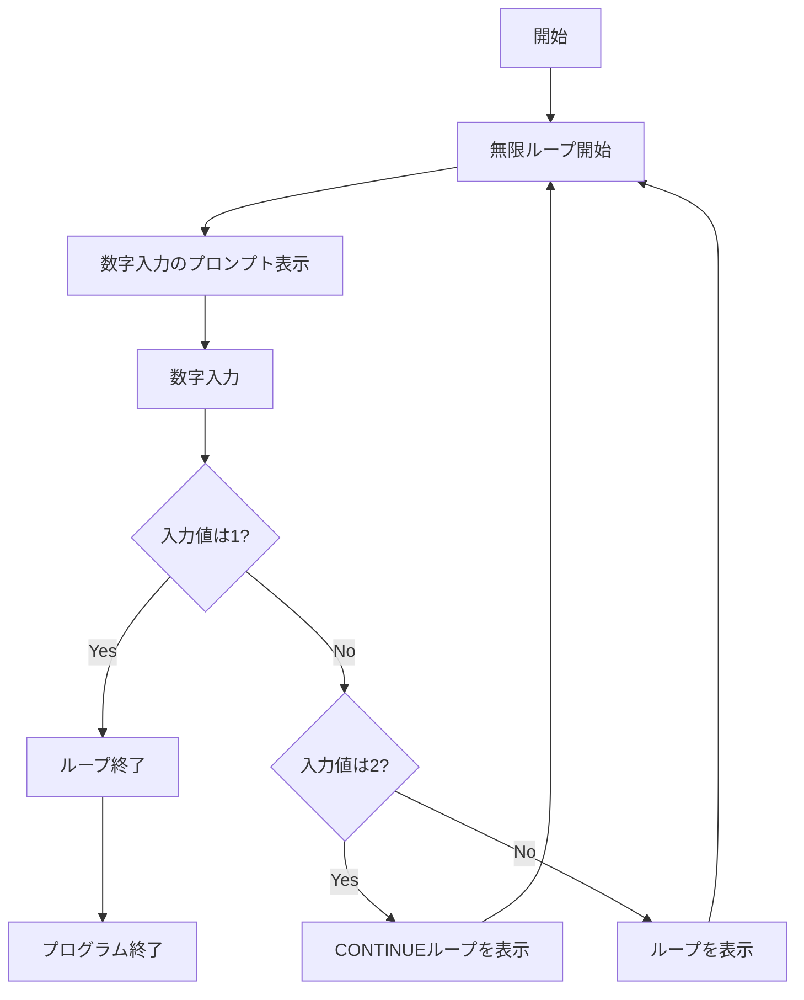
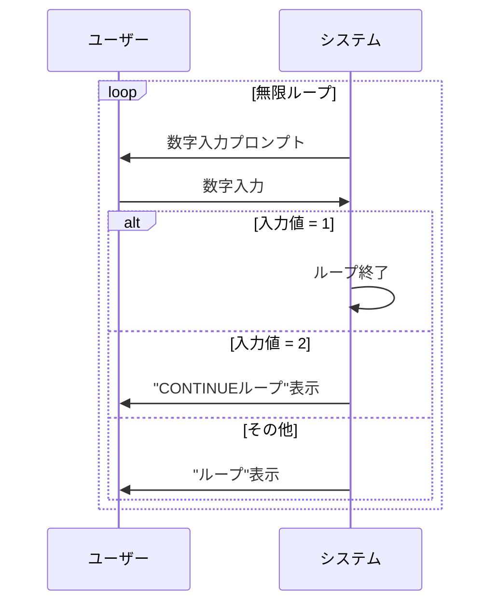

# LoopBreakContinue 詳細設計書

## 1. 機能要件

- 無限ループ内で数字入力を受け付ける
- 入力値に応じて以下の制御を実施:
  1. 入力値が1の場合: ループを終了（break）
  2. 入力値が2の場合: "CONTINUEループ"を表示して次の繰り返しへ（continue）
  3. それ以外の場合: "ループ"を表示して処理継続

## 2. クラス設計

### 2.1 クラス図



### 2.2 クラス定義

| 項目 | 内容 |
|------|------|
| クラス名 | LoopBreakContinue |
| パッケージ/名前空間 | なし（デフォルトパッケージ） |
| 修飾子 | public |

## 3. メソッド設計

### 3.1 mainメソッド

#### 3.1.1 メソッド定義

| 項目 | 内容 |
|------|------|
| 修飾子 | public static |
| 戻り値の型 | void |
| メソッド名 | main |
| 引数 | String[] args |

#### 3.1.2 機能説明

- for(;;)またはwhile(true)を使用して無限ループを構築
- キーボードから数値入力を受け付ける
- 入力値に応じて制御:
  - 1: breakでループ終了
  - 2: continueで次のループへ
  - その他: メッセージ表示して継続

## 4. 処理フロー

### 4.1 処理フローチャート



### 4.2 システム動作シーケンス



## 5. 入出力設計

### 5.1 入力仕様

1. 入力データ
   - キーボードからの数字入力
   - 整数値のみ
   - 数値以外は入力されないことを前提

### 5.2 出力仕様

1. プロンプトメッセージ
   - 形式："数字入力"
   - 改行を含む

2. 処理結果メッセージ
   - 入力値が2の場合："CONTINUEループ"
   - それ以外の場合："ループ"
   - 改行を含む

3. 出力例：

   ```text
   数字入力 2
   CONTINUEループ
   数字入力 3
   ループ
   数字入力 1
   ```

## 6. エラー処理

- なし（入力値は数字のみと前提）
