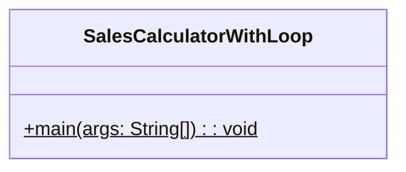
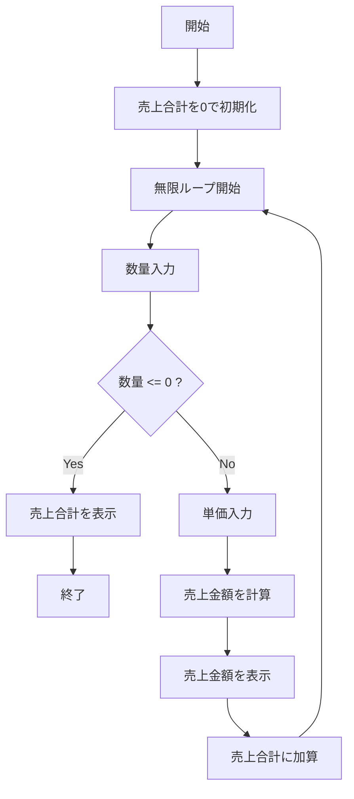
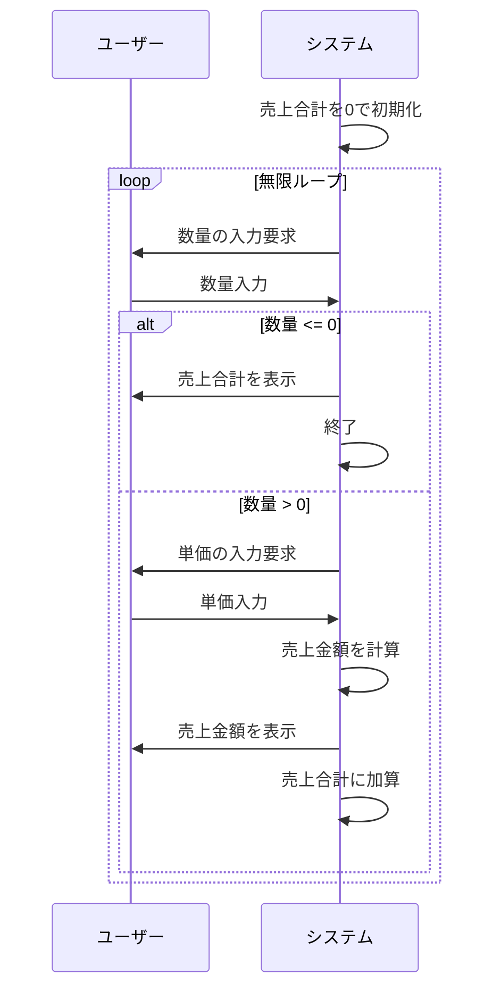

# SalesCalculatorWithLoop 詳細設計書

## 1. 機能要件

- 商品の売上計算を無限ループで実行
- 各取引について：
  - 単価と数量を入力として受け取る
  - 売上金額を計算して表示
- 数量に0以下の値が入力された場合に処理を終了
- 終了時に売上合計を表示

## 2. クラス設計

### 2.1 クラス図



### 2.2 クラス定義

| 項目 | 内容 |
|------|------|
| クラス名 | SalesCalculatorWithLoop |
| パッケージ/名前空間 | なし（デフォルトパッケージ） |
| 修飾子 | public |

## 3. メソッド設計

### 3.1 mainメソッド

#### 3.1.1 メソッド定義

| 項目 | 内容 |
|------|------|
| 修飾子 | public static |
| 戻り値の型 | void |
| メソッド名 | main |
| 引数 | String[] args |

#### 3.1.2 機能説明

- while(true)を使用して無限ループを構築
- 各ループで以下を実行：
  1. 数量の入力受付
  2. 数量が0以下の場合はループを終了
  3. 単価の入力受付
  4. 売上金額の計算（数量×単価）
  5. 売上金額の表示
  6. 売上合計への加算
- ループ終了後に売上合計を表示

## 4. 処理フロー

### 4.1 処理フローチャート



### 4.2 システム動作シーケンス



## 5. 入出力設計

### 5.1 入力仕様

1. 入力データ
   - キーボードからの整数入力を繰り返し受付
   - 数量：整数値（1以上。0以下で終了）
   - 単価：整数値（正負両方可）
   - 入力値は正しい整数値のみと前提

### 5.2 出力仕様

1. プロンプトメッセージ
   - 数量入力用："数量？ "
   - 単価入力用："単価？ "

2. 売上金額表示
   - 形式："売上 = {計算結果}"
   - {計算結果}は数量×単価の値

3. 売上合計表示
   - 形式："合計 = {合計金額}"
   - プログラム終了時のみ表示

4. 出力例：

   ```text
   数量？ 28
   単価？ 250
   売上 = 7000
   数量？ 15
   単価？ -200
   売上 = -3000
   数量？ -1
   合計 = 4000
   ```

## 6. エラー処理

- なし（入力値は整数で、かつ正しい値が入力されることを前提）
