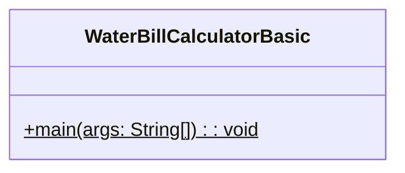
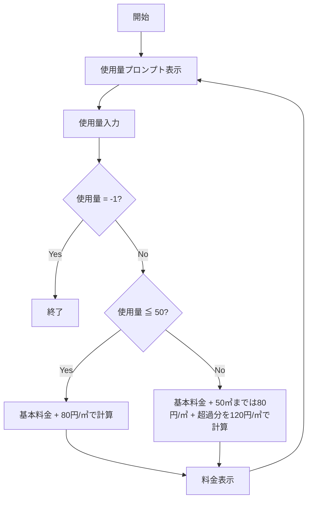

# WaterBillCalculatorBasic 詳細設計書

## 1. 機能要件

※ 料金体系の詳細は[WaterBillRates.md](./WaterBillRates.md)を参照してください。

- 一般用水道料金（区分コード：1）の計算と表示
- キーボードから使用量を繰り返し入力
- 使用量に応じた2段階の料金計算:
  - 50㎥以下: 基本料金1000円 + 80円/㎥
  - 50㎥超: 基本料金1000円 + 120円/㎥ (超過分)
- 使用量が-1の場合にプログラム終了
- 入力値は整数で、かつ正しい値が入力されることを前提

## 2. クラス設計

### 2.1 クラス図



### 2.2 クラス定義

| 項目 | 内容 |
|------|------|
| クラス名 | WaterBillCalculatorBasic |
| パッケージ/名前空間 | なし（デフォルトパッケージ） |
| 修飾子 | public |

## 3. メソッド設計

### 3.1 mainメソッド

#### 3.1.1 メソッド定義

| 項目 | 内容 |
|------|------|
| 修飾子 | public static |
| 戻り値の型 | void |
| メソッド名 | main |
| 引数 | String[] args |

#### 3.1.2 機能説明

- 無限ループで使用量の入力を受け付ける
- 入力値が-1の場合はループを終了
- 使用量に応じた料金を計算：
  1. 基本料金1000円を加算
  2. 使用量が50㎥以下の場合は80円/㎥を加算
  3. 使用量が50㎥を超える場合は:
     - 最初の50㎥分は80円/㎥
     - 超過分は120円/㎥を加算
- 計算結果を表示

## 4. 処理フロー

### 4.1 処理フローチャート



## 5. 入出力設計

### 5.1 入力仕様

1. 入力方法
   - キーボードから整数値を入力
   - プロンプトを表示して入力を促す

2. 入力値の制約
   - 整数値のみ
   - -1:プログラム終了
   - その他の負の値は想定しない
   - 上限値の制約なし

### 5.2 出力仕様

1. 入力プロンプト
   - "使用量？ "を表示
   - 改行なし

2. 計算結果表示
   - 形式："料金={計算結果}円"
   - 改行を含む

3. 出力例：

   ```text
   使用量？ 15
   料金=2200円
   使用量？ 53
   料金=5360円
   使用量？ -1
   ```

## 6. エラー処理

- なし（入力値は整数で、かつ正しい値が入力されることを前提とする）

## 7. 注意事項

- 料金計算時のオーバーフローに注意
- 超過量の計算時は50㎥を超えた分のみを対象とする
