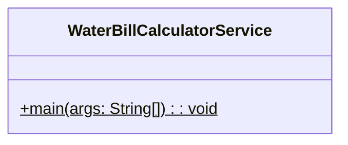
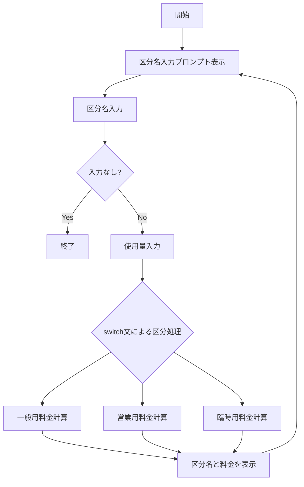
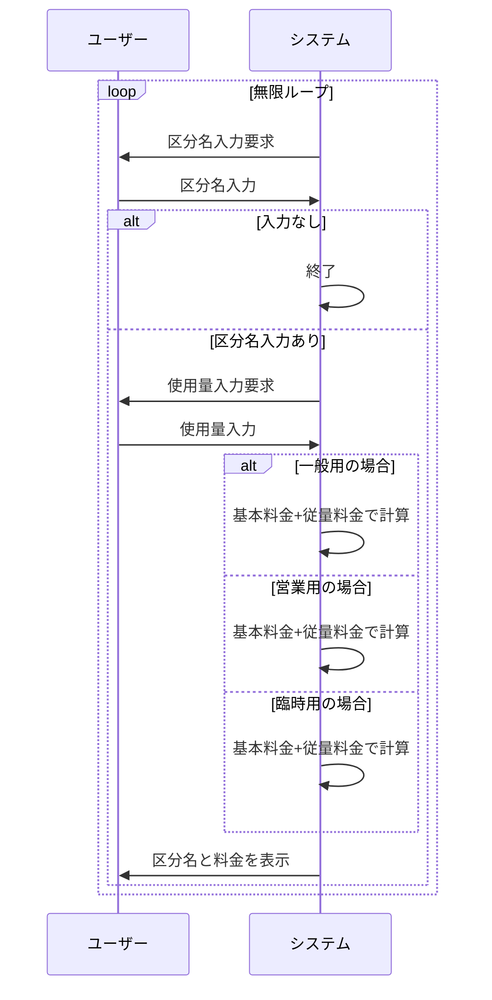

# WaterBillCalculatorService 詳細設計書

## 1. 機能要件

※ 料金体系の詳細は[WaterBillRates.md](./WaterBillRates.md)を参照してください。

- 全区分（一般用、営業用、臨時用）に対応した水道料金計算
- キーボードから区分名と使用量を入力として受け付ける
- 文字列のswitch文を使用した区分処理の実装
- 区分名の入力で何も入力せずにエンターを押した場合に終了

## 2. クラス設計

### 2.1 クラス図



### 2.2 クラス定義

| 項目 | 内容 |
|------|------|
| クラス名 | WaterBillCalculatorService |
| パッケージ/名前空間 | なし（デフォルトパッケージ） |
| 修飾子 | public |

## 3. メソッド設計

### 3.1 mainメソッド

#### 3.1.1 メソッド定義

| 項目 | 内容 |
|------|------|
| 修飾子 | public static |
| 戻り値の型 | void |
| メソッド名 | main |
| 引数 | String[] args |

#### 3.1.2 機能説明

- キーボードから区分名と使用量を繰り返し入力
- 区分名に応じて異なる料金計算を実施:
  1. 一般用：基本料金1000円に加えて
     - 50㎥以下：80円/㎥
     - 50㎥超：超過分を120円/㎥
  2. 営業用：基本料金1300円 + 150円/㎥
  3. 臨時用：基本料金2300円 + 240円/㎥
- 計算結果を区分名とともに表示

## 4. 処理フロー

### 4.1 処理フローチャート



### 4.2 システム動作シーケンス



## 5. 入出力設計

### 5.1 入力仕様

1. 入力方法
   - キーボードから文字列入力を受け付ける
   - 何も入力せずにエンターを押した場合に終了
   - プロンプトを表示して入力を促す

2. 入力値
   - 区分名：一般、営業、臨時のいずれか
   - 使用量：正の整数値

※具体的な入力方法の実装については、各言語のガイドラインを参照してください。

### 5.2 出力仕様

1. 入力プロンプト
   - 区分名入力用："区分（一般、営業、臨時、入力なしで終了）？ "
   - 使用量入力用："使用料？ "

2. 計算結果表示
   - 形式："{区分名}－－－－料金={計算結果}円"
   - 区分名：一般、営業、臨時のいずれか

3. 出力例：

   ```text
   区分（一般、営業、臨時、入力なしで終了）？
   一般
   使用料？ 15
   一般－－－－料金=2200円
   区分（一般、営業、臨時、入力なしで終了）？
   営業
   使用料？ 25
   営業－－－－料金=5050円
   区分（一般、営業、臨時、入力なしで終了）？
   臨時
   使用料？ 79
   臨時－－－－料金=21260円
   区分（一般、営業、臨時、入力なしで終了）？
   
   処理終了
   ```

## 6. エラー処理

- なし（入力値は正しい値が入力されることを前提）
