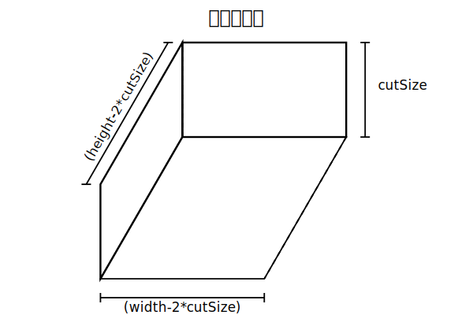
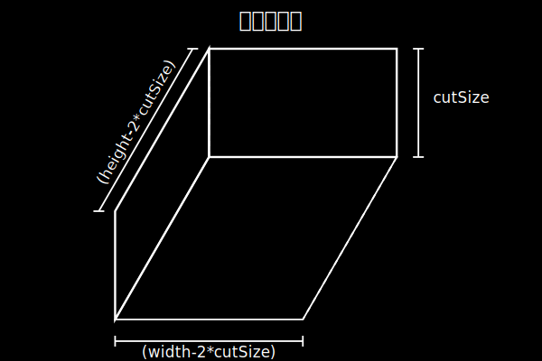
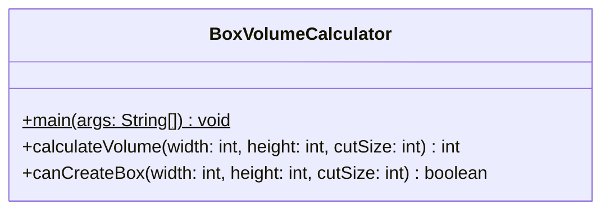
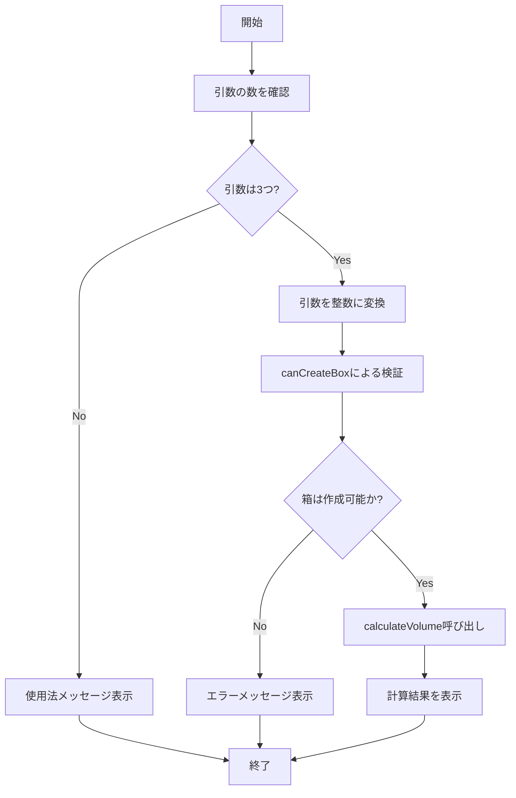

# BoxVolumeCalculator 詳細設計書

## 1. 機能要件

- 画用紙から箱を作成する際の容積を計算
- 入力値（幅width、高さheight、切り取る辺の長さcutSize）をコマンドライン引数として受け取る
- 容積計算は独立したメソッドで実行
- 入力値の妥当性を検証し、不正な値の場合はエラー表示

### 1.1 箱の作成方法と容積計算




容積volume の計算式：volume = (width-2\*cutSize)(height-2\*cutSize)cutSize

## 2. クラス設計

### 2.1 クラス図



### 2.2 クラス定義

| 項目 | 内容 |
|------|------|
| クラス名 | BoxVolumeCalculator |
| パッケージ/名前空間 | なし（デフォルトパッケージ） |
| 修飾子 | public |

## 3. クラス図の各操作が実現すべき処理

### 3.1 main

- コマンドライン引数から3つの整数値を取得
- 引数値をint型に変換
- canCreateBoxで入力値の妥当性を検証
- 検証OKならcalculateVolumeで容積を計算
- 計算結果を表示

### 3.2 calculateVolume

- 引数で渡された寸法から箱の容積を計算
- 計算式：(width-2\*cutSize) \* (height-2*cutSize) \* cutSize
- 計算結果をint型で返却

### 3.3 canCreateBox

- 入力された寸法で箱が作成可能かを検証
- 寸法の組み合わせが適切な場合はtrueを返却
- 箱が成立しない寸法の場合はfalseを返却

## 4. 処理フロー

### 4.1 処理フローチャート



## 5. 入出力設計

### 5.1 入力仕様

- コマンドライン引数として3つの整数値を受け取る
  1. 画用紙の幅width
  2. 画用紙の高さheight
  3. 切り取る正方形の辺の長さcutSize

### 5.2 出力仕様

1. ヘッダーメッセージ
   - "画用紙から作る箱の容積を求める"
   - 引数の数が正しい場合のみ表示

2. パラメータ表示
   - 形式："width={width}, height={height}, cutSize={cutSize}"
   - 引数の数が正しい場合のみ表示

3. 結果メッセージ
   - 正常時："容積={計算結果}"
   - 不正な値の場合："入力値に誤りがあります！"
   - 引数不足時："使用法：java BoxVolumeCalculator width height cutSize"

4. 出力例：

   ```text
   # 正常な実行例
   > java BoxVolumeCalculator 100 200 10
   画用紙から作る箱の容積を求める
   width=100, height=200, cutSize=10
   容積=144000

   # 不正な値の例
   > java BoxVolumeCalculator 100 200 50
   画用紙から作る箱の容積を求める
   width=100, height=200, cutSize=50
   入力値に誤りがあります！

   # 引数不足の例
   > java BoxVolumeCalculator 100 200
   使用法：java BoxVolumeCalculator width height cutSize
   ```

## 6. エラー処理

1. コマンドライン引数の数が3つであることをチェック
2. 以下の場合にエラーメッセージを表示：
   - 入力値が不正な場合
   - 箱が成立しない寸法の組み合わせの場合

※ 具体的な制約条件：

- cutSize > 0
- (width-2\*cutSize) > 0 かつ (height-2\*cutSize) > 0
