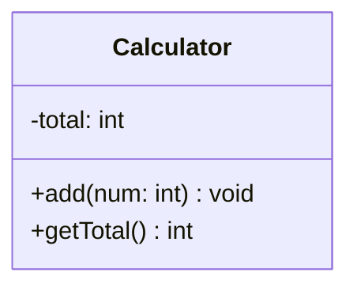

# クラス図入門

クラス図はUMLの一部として標準化されており、どのプログラミング言語でも共通して使える設計図です。以下の説明ではJavaを例として使用しますが、読み取る情報はすべての言語で同じです。

## 1. UMLとクラス図

### 1.1 UMLについて

- 統一モデリング言語（Unified Modeling Language）
- システム設計のための国際標準図記法
- 言語に依存しない設計表現
- 14種類の図の中の1つがクラス図

### 1.2 クラス図の位置づけ

- プログラムの**静的な構造**を表現する図
- 各クラスが持つ属性と操作を示す
- プログラム設計の基本となる図

## 2. クラス図の特徴と限界

### 2.1 クラス図で分かること

- クラスが持つ属性
- クラスが提供する操作
- 属性の型や操作の入出力

### 2.2 クラス図だけでは分からないこと

- 操作の処理内容
- 操作の呼び出し順序
- 属性の使われ方
- プログラムの実行の流れ

### 2.3 プログラマの役割

- 示された構造に基づいて実装を行うこと
- クラス図は「何を」実装するかを示すもの
- 「どのように」実装するかはプログラマの仕事
- クラス図に示された機能を、正しく動作するプログラムとして作り上げる

## 3. クラス図の基本構造

### 3.1 クラス図の3段構造

クラス図は3つの部分から構成されています：

1. 上段
   - クラスの名前を表現
   - この例では`Calculator`というクラス

2. 中段
   - クラスが持つ属性を表現
   - Javaではフィールドに相当
   - この例では整数型の`total`

3. 下段
   - クラスが持つ操作を表現
   - Javaではメソッドに相当
   - この例では`add`と`getTotal`という2つの操作

それぞれの詳しい読み方は、次の「クラス図の読み方」で説明します。
