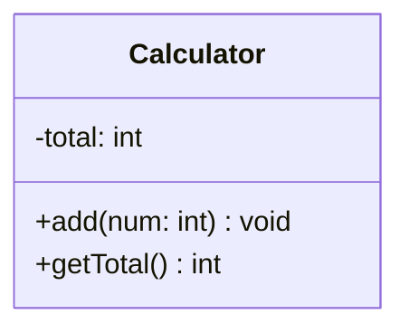
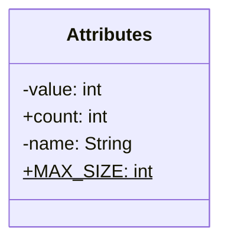
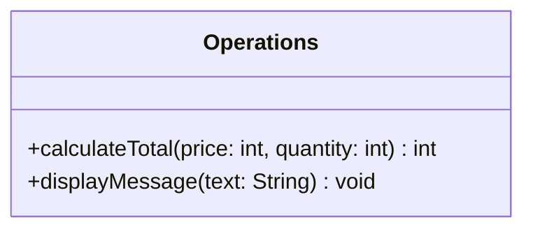
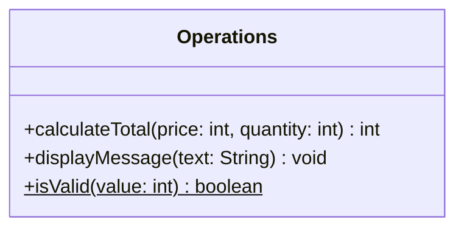
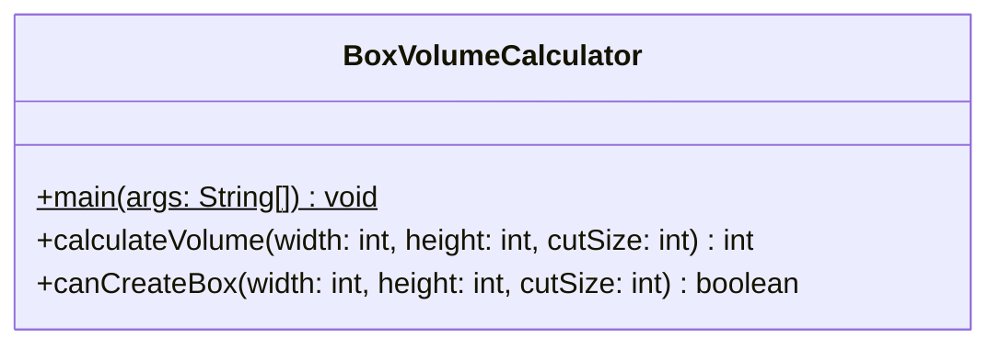

# クラス図の読み方

クラス図から必要な情報を読み取る方法を学びます。

## 1. クラスを読む

### 1.1 クラス図の構造



クラス図は3つの部分から構成されています：

1. 上段
   - クラスの名前を表現
   - この例では`Calculator`というクラス

2. 中段
   - クラスが持つ属性を表現
   - Javaではフィールドに相当
   - この例では整数型の`total`

3. 下段
   - クラスが持つ操作を表現
   - Javaではメソッドに相当
   - この例では`add`と`getTotal`という2つの操作

それぞれの詳しい読み方は、以降のセクションで説明します。

## 2. 属性を読む

### 2.1 属性の基本形



属性は以下の形式で記述されます：

```text
修飾子 属性名: 型
```

### 2.2 アクセス修飾子とstatic

- アクセス修飾子は属性と操作の両方に適用
  - `-`（マイナス）は`private`：そのクラスの中だけで使える
  - `+`（プラス）は`public`：どこからでも使える
- 一般的に属性は`private`にする
- 下線は`static`（静的）を表す：クラスに属する（インスタンス不要の）メンバー

## 3. 操作を読む

### 3.1 操作の基本形



操作は以下の形式で記述されます：

```text
修飾子 操作名(引数名: 型, ...): 戻り値の型
```

### 3.2 引数リストの読み方

- カッコ`()`の中に引数を記述
- 複数の引数はカンマ`,`で区切る
- 各引数は`引数名: 型`の形式
- 引数がない場合は`()`のみ

## 4. 具体例での確認

この例ではJavaのクラス図を使用して説明します。

### 4.1 基本的な例

#### 属性の例


このクラス図は、Java言語では次のように実装されます：

```java
public class Attributes {
    private int value;        // privateな属性
    public int count;        // publicな属性
    private String name;     // privateな属性
    public static int MAX_SIZE;  // publicで静的な属性
}
```

#### 操作の例



このクラス図は、Java言語では次のように実装されます：

```java
public class Operations {
    public int calculateTotal(int price, int quantity) {  // 整数を返す操作
        return price * quantity;
    }

    public void displayMessage(String text) {  // 何も返さない操作
        System.out.println(text);
    }

    public static boolean isValid(int value) {  // 真偽値を返す静的操作
        return value > 0;
    }
}
```

### 4.2 BoxVolumeCalculatorの例



### 4.2 クラス図の読み取り

1. クラス名：`BoxVolumeCalculator`
   - ファイル名は`BoxVolumeCalculator.java`となる

2. メソッド一覧：
   - `main`: プログラムの開始点（`static`メソッド）
     - 引数：`String[]型`の`args`（コマンドライン引数）
     - 戻り値：`void`（返値なし）

   - `calculateVolume`: 容積の計算
     - 引数：`width`, `height`, `cutSize`（すべて`int型`）
     - 戻り値：`int`（計算結果の容積）

   - `canCreateBox`: 箱が作れるかの判定
     - 引数：`width`, `height`, `cutSize`（すべて`int型`）
     - 戻り値：`boolean`（作れるならtrue）

### 4.3 読み取りのまとめ

1. まずクラス名を確認
2. 提供されるメソッドの一覧を把握
   - それぞれの用途
   - 必要な情報（引数）
   - 得られる結果（戻り値）
3. クラスが提供する機能の全体像を理解
