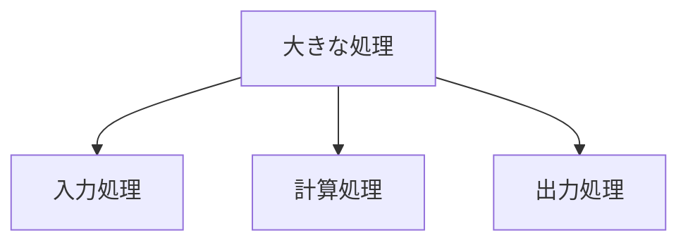

# プログラム構造の設計ガイドライン

# このガイドラインの使い方

このガイドラインは一度に全てを読む必要はありません。

## 初めて読む方へ

まずは以下のセクションから読み始めることをお勧めします：

- 1.1 プログラム構造化の目的
- 1.2 単一責任の原則
- 2.1 基本的な設計指針

## コーディング中の方へ

実装例や問題解決方法は以下のセクションを参照してください：

- 2.3 実装例と解説
- 3.2 よくある問題とその解決
- 4.2 コードの改善例

# 目次

## 1. 基本原則

### 1.1 プログラム構造化の目的

- コードの再利用性向上
- デバッグのしやすさ
- チーム開発での協働
- 長期的な保守性

### 1.2 単一責任の原則（初学者向け解説）

- 「1つの処理は1つの場所に」という基本概念
- なぜ処理を分けるのか（具体例で説明）
- 適切な分割の見分け方



## 2. メソッドの設計

### 2.1 基本的な設計指針

- メソッドの適切な長さ（20行程度を目安）
- 入力と出力を明確に
- 副作用を避ける

### 2.2 引数の設計

- 引数は3つまでを目安に
- 引数の順序の考え方
- 引数の型の選び方

### 2.3 実装例と解説

```java
// 良い例：目的が明確で再利用可能
int calculateTotal(int unitPrice, int quantity) {
    return unitPrice * quantity;
}

// 避けるべき例：複数の処理が混在
void processOrder(Order order) {
    validateOrder(order);  // 検証
    calculateTotal(order); // 計算
    saveOrder(order);      // 保存
    sendEmail(order);      // メール送信
}
```

## 3. 構造化のパターン

### 3.1 基本的なパターン

- 入力→処理→出力の分割
- 検証処理の分離
- ユーティリティメソッドの作成

### 3.2 よくある問題とその解決

- 条件分岐が多い場合の分割方法
- 繰り返し処理の構造化
- 例外処理の分離

## 4. 実践的なコーディング

### 4.1 段階的な実装手順

1. 処理の全体像を把握
2. 個別の処理に分割
3. インターフェースの設計
4. 実装とテスト

### 4.2 コードの改善例

```java
// 改善前
void processData(String input) {
    // 入力チェック
    if (input == null || input.isEmpty()) {
        return;
    }
    // データ変換
    int value = Integer.parseInt(input);
    // 計算処理
    int result = value * 2;
    // 結果表示
    System.out.println("Result: " + result);
}

// 改善後
boolean validateInput(String input) {
    return input != null && !input.isEmpty();
}

int convertToNumber(String input) {
    return Integer.parseInt(input);
}

int calculate(int value) {
    return value * 2;
}

void displayResult(int result) {
    System.out.println("Result: " + result);
}
```

## 5. 演習と確認

### 5.1 構造化の練習問題

- 単一の大きなメソッドを適切に分割する演習
- 条件分岐の整理と構造化
- リファクタリングの実践

### 5.2 コードレビューの観点

- メソッドの責任範囲は適切か
- 名前は処理内容を適切に表現しているか
- 再利用性は確保されているか

## 6. よくある質問と回答

- Q: メソッドの分割はどこまでするべき？
- Q: 引数が多くなってしまう場合は？
- Q: 例外処理はどう構造化する？
