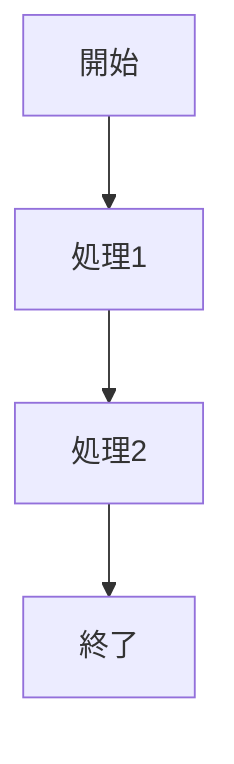

# [クラス名].java 詳細設計書

## 1. 機能要件

- [プログラムが実現する機能を箇条書きで記述]

## 2. クラス設計

### 2.1 クラス図

```mermaid
classDiagram
    class [クラス名] {
        [メソッド定義]
    }
```

### 2.2 クラス定義

| 項目 | 内容 |
|------|------|
| クラス名 | [クラス名] |
| パッケージ | [パッケージ名/なし（デフォルトパッケージ）] |
| 修飾子 | [public/private等] |

## 3. メソッド設計

### 3.1 [メソッド名]メソッド

#### 3.1.1 メソッド定義

| 項目 | 内容 |
|------|------|
| 修飾子 | [アクセス修飾子] |
| 戻り値の型 | [戻り値の型] |
| メソッド名 | [メソッド名] |
| 引数 | [引数リスト] |

#### 3.1.2 機能説明

- [メソッドの機能を箇条書きで記述]

## 4. 処理フロー



## 5. 入出力設計

### 5.1 入力仕様

- [入力に関する説明]
- [入力形式、制約事項等]

### 5.2 出力仕様

- [出力に関する説明]
- 出力例：

  ```text
  [出力例を記述]
  ```

## 6. エラー処理

- [想定されるエラーとその処理方法を記述]

## 7. 実装上の注意点

### 7.1 コーディング規約

- [準拠すべきコーディング規約を記述]

### 7.2 文字コード

- [使用する文字コードを記述]

## 8. 動作環境と実行方法

### 8.1 必要な環境

- JDK (Java Development Kit) 8以上
- テキストエディタまたはIDE

### 8.2 実行方法

1. ソースファイルをコンパイル

   ```bash
   javac [クラス名].java
   ```

2. プログラムを実行

   ```bash
   java [クラス名]
   ```
