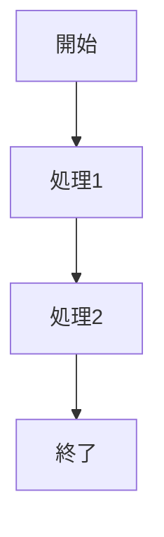
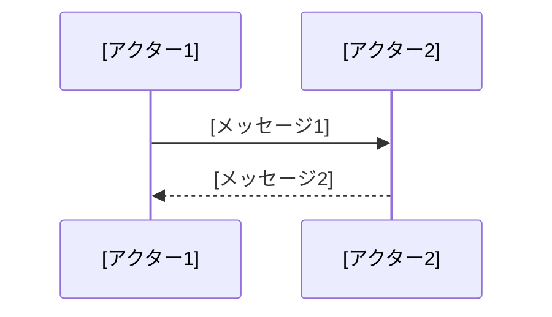

# [クラス名] 詳細設計書

## 1. 機能要件

- [プログラムが実現する機能を箇条書きで記述]
- [具体的な要件を簡潔に記述]
- [必要な制約条件があれば記述]

## 2. クラス設計

### 2.1 クラス図

```mermaid
classDiagram
    class [クラス名] {
        [メソッド定義]
    }
```

### 2.2 クラス定義

| 項目 | 内容 |
|------|------|
| クラス名 | [クラス名] |
| パッケージ/名前空間 | [パッケージ名/名前空間/なし] |
| 修飾子 | [public/private等] |

## 3. メソッド設計

### 3.1 [メソッド名]メソッド

#### 3.1.1 メソッド定義

| 項目 | 内容 |
|------|------|
| 修飾子 | [アクセス修飾子] |
| 戻り値の型 | [戻り値の型] |
| メソッド名 | [メソッド名] |
| 引数 | [引数リスト] |

#### 3.1.2 機能説明

- [メソッドの主な処理を箇条書きで記述]
- [処理の順序や条件を記述]
- [特記すべき動作があれば記述]

## 4. 処理フロー

### 4.1 処理フローチャート



### 4.2 システム動作シーケンス

※ユーザー入力がある処理、または複数のクラスやメソッドが連携する処理の場合のみ記述


  
## 5. 入出力設計

### 5.1 入力仕様

- [入力の形式]
- [制約事項]
- [入力例があれば記述]

※実装に関する補足情報がある場合は、対応する実装ガイドライン（docs/guidelines/implementation/）を参照してください。

### 5.2 出力仕様

1. [出力の種類1]
   - [出力内容の説明]
   - [表示形式の補足]

2. [出力の種類2]（必要な場合）
   - [出力内容の説明]
   - [表示形式の補足]

3. 出力例：

   ```text
   [出力例を記述]
   ```

## 6. エラー処理

- [想定されるエラーの種類]
- [エラー時の動作]
